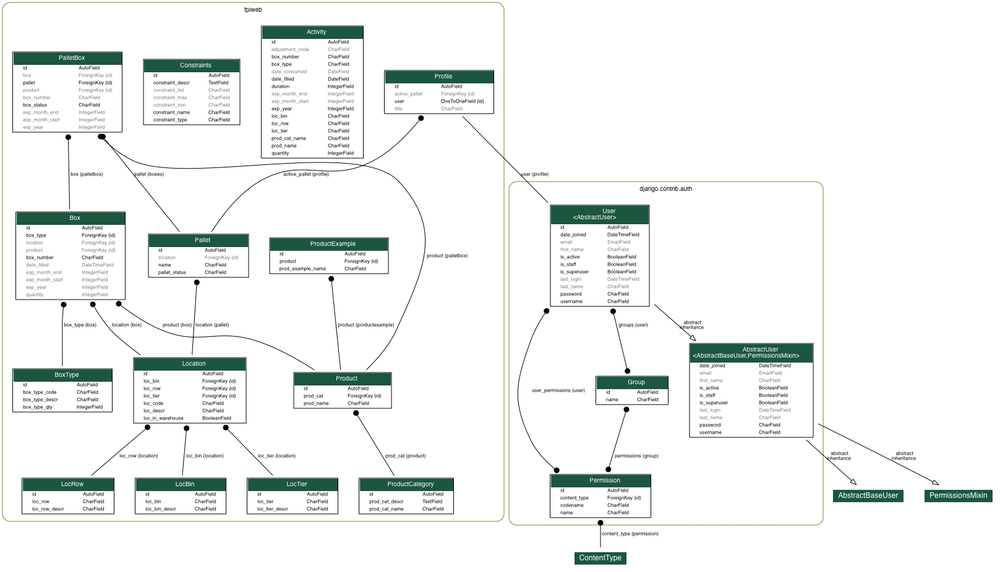

*******************
Developer Resources
*******************

Table Relationships
===================

Image expressed as a png file.

Documentation Tools
===================

Some good possible sources to learn things:

#.  `Writing Sphinx documentation <http://www.writethedocs
.org/guide/tools/sphinx/>`_

    Explains what Sphinx is and why we should use it.

#.  `Django main web site <https://docs.djangoproject.com/en/2.2/>`_

    (Currently we are using version 2.2.1.)
