###########################
Individual Box Instructions
###########################

After logging in click on the blue **Manual Box and Pallet Maintence** button as shown
below to begin processing a box or a pallet. You will be directed to the
**Manual Box and Pallet Management** screen.

.. image:: manual_box_images/ManualBoxStart_0_00_06.png

Manual Box and Pallet Management Screen
++++++++++++++++++++++++++++++++++++++++

To manually manage a pallet click on the **Manage a pallet manually** link as shown
below.

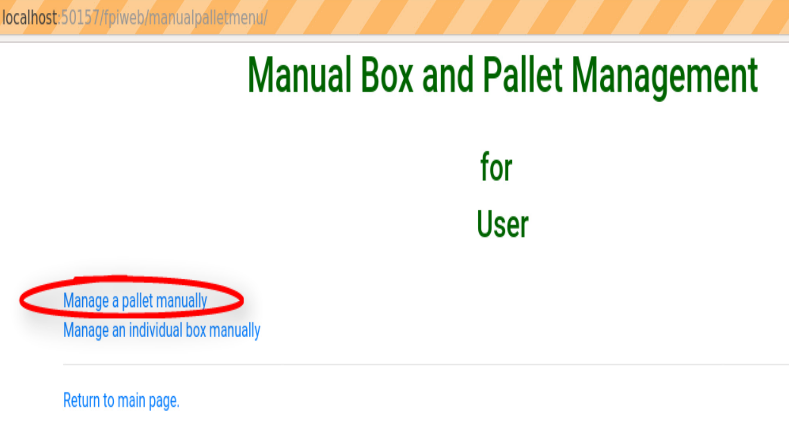

To manage individual boxes of product click on the **Manage an individual box manually**
link as shown below.

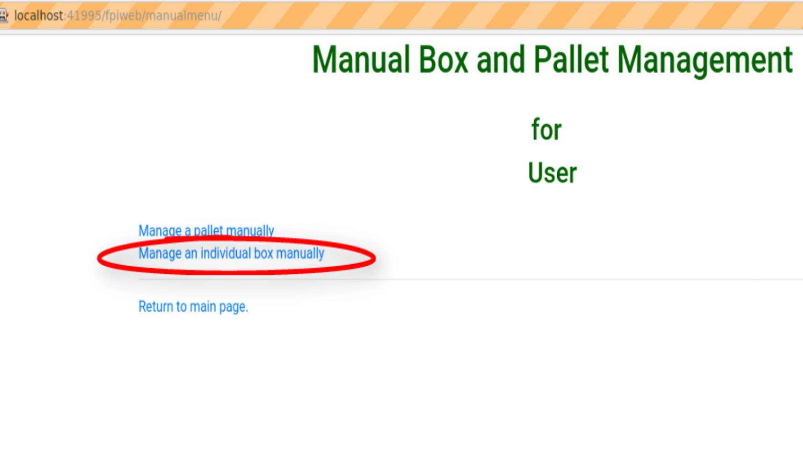

Manual Pallet Management Screens
++++++++++++++++++++++++++++++++

If you clicked on the **Manage a pallet manuallyy** link you should be
directed to the **Manual Pallet Management** screen.
Here you will see 3 menu items.

+ **Start a New Pallet**
+ **Select a pallet in progress**
+ **Move a pallet**

Currently the only link that is working is the **Move a pallet** link. To change the
location of a pallet click on **Move a pallet** as shown below.

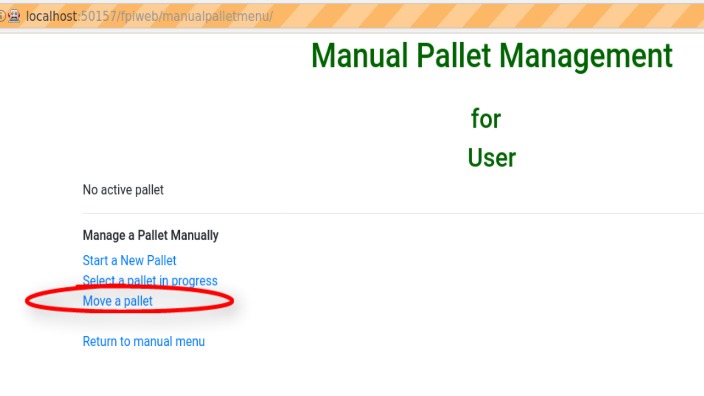

Move a Pallet Screens
======================

After clicking on **Move a pallet** you should see a screen like the one below. This
screen allows you to move the location of each pallet along with its boxes in the
database records. Basically if you move a pallet you are also moving the boxes the pallet
contains.

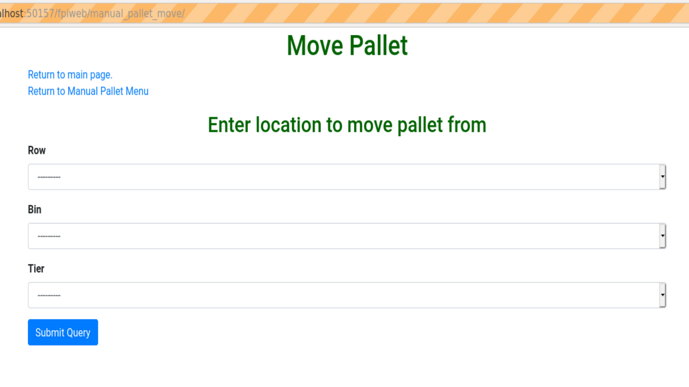

When moving a pallet (with its boxes) three different conditions can occur.

1. Move a pallet and its boxes to an empty pallet location.
#. Move a pallet and its boxes to non-empty pallet location.
#. Attempt to move an empty pallet with no boxes.

All three conditions will be shown below.

Move a Pallet to an Empty Pallet Location
------------------------------------------

When moving a pallet and its boxes to a new location the first thing you need to
do is to "Enter location to move pallet from". You enter the position of the pallet
by selecting the Row, Bin, and Tier dropdown lists by using the mouse to click on the down
arrow at the right of each dropdown list. Selecting the down arrow as shown below in the
Row dropdown list brings a set of choices. Simply click on the current Row location choice
to "Enter the location to move pallet from".

.. image:: manual_box_images/SelectRowFromDropDownList_0_00_21.png

Do the same with the Row and Tier locations. Once that is done you should see the
**Move Pallet** screen as filled out below with Row, Bin, and Tier locations filled out.
Then click on the blue **Submit Query** button.

.. image:: manual_box_images/SubmitQuery_0_00_23.png

This will bring you to a similar screen but this new screen will say "Enter location
to move pallet **to**". Enter the Row, Bin, and Tier location for where the pallet
and it's boxes will be moved to. The screen below shows the new Tier location being
chosen.

.. image:: manual_box_images/SelectTierTo2_0_00_20.png

Once the **Enter location to move pallet to** screen has been filled out click on the
blue **Submit Query** button. If the new location you want to move the pallet is empty
and has no boxes you should see a screen similar to the one shown immediately below.

.. image:: manual_box_images/MovePalletFinish_0_00_39.png

If the "Enter location to move pallet to" is NOT EMPTY then you will see a screen like
the one shown in the next section below.

Move a Pallet and Its Boxes to a Non-Empty Pallet Location
-----------------------------------------------------------

The screen below shows up when you try to move a pallet to a location where a pallet is
already located. Notice that the message states "There are 2 boxes at 01,03,C2".

.. image:: manual_box_images/BoxesAtLocation_0_01_21.png

This means you will have to make a decision, either (1) choose a new location by clicking
the **Change To Location** choice or (2) merge the pallets by clicking the **Merge Pallets**
choice.

.. image:: manual_box_images/SelectOptionLocationMerge_0_01_30.png

If you click on **Change to Location** you will be directed back to the **Enter location
to move pallet to** screen as shown above. From there you can select another location to
move the pallet to.

If you click on **Merge Pallets** both pallets along with their boxes will be merged
into the new location you picked from the **Enter location to move pallet to** screen.
You will see a screen stating "boxes move to row, bin, tier".

Attempt to Move an Empty Pallet
---------------------------------

If you attempt "Enter location to move pallet from" and there are no boxes recorded
in the database for that pallet location you will see a screen similar to the one shown
below.

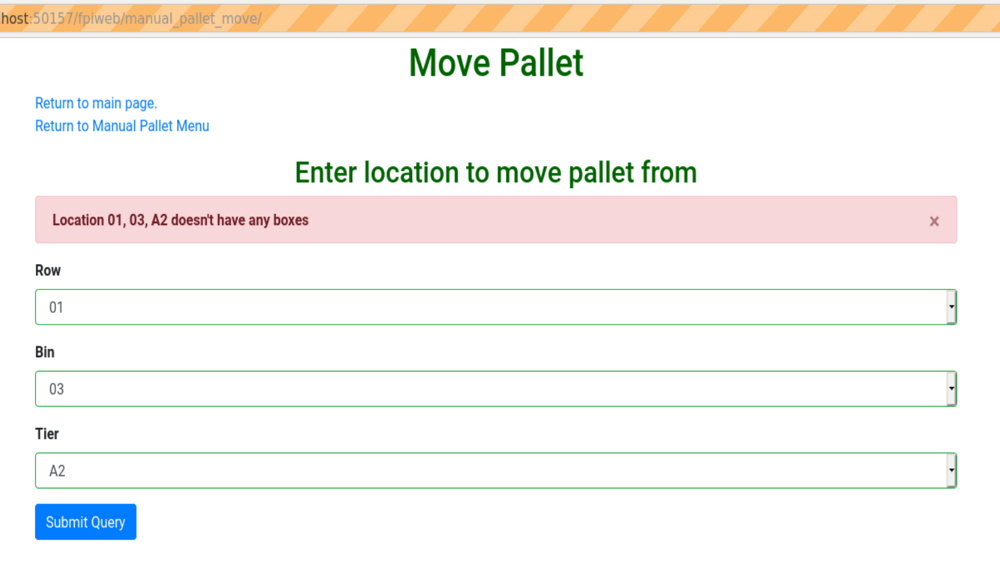

Manual Box Management Screens
+++++++++++++++++++++++++++++

If you clicked on the **Manage an individual box manually** link you should be
directed to the **Manual Box Management** screen.
Here you will see 5 menu items.

+ **Check the status of a box**
+ **Add a new box to inventory**
+ **Checkin a new box**
+ **Checkout (consume product in) a box**
+ **Move a box**

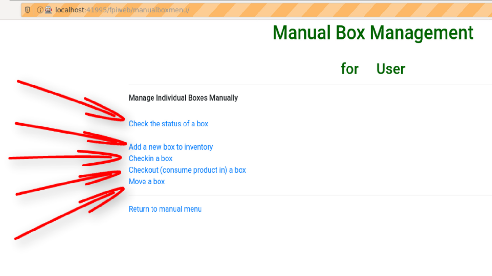

Of course you can also **Return to manual menu**. Each of the 5 menu items will be discussed
below.

|

Manual Status a Box Screen
============================

From Manual Box Management clicking on **Check the status of a box** will bring you to the
**Manual Status a Box** screen. Here you can check th box status by entering a 5 digit
box number and then clicking on the **Search** button.

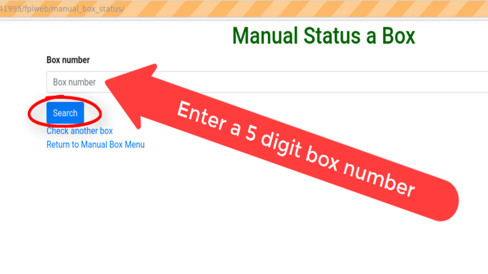

After clicking on the **Search** button you should see a screen listing the Box Number,
Box Type, Box Contents, Contents Expire (expiration date) and location- Row, Bin and Tier
number.

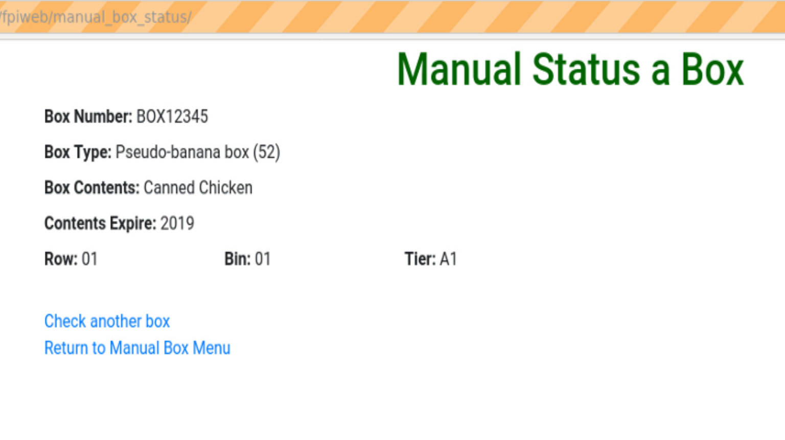

From this screen you can click on **Check another box** or **Return to Manual Box Menu**.

|

New Box Screen
================

With this screen you can add a new box following the 4 steps listed below.

    (1) Enter a 5 digit box number.
    (2) Click on the drop down list triangle at the far right.
    (3) Choose an item from the drop down list.
    (4) Finally click on the **Add Box** button (hidden from view in the below graphic).

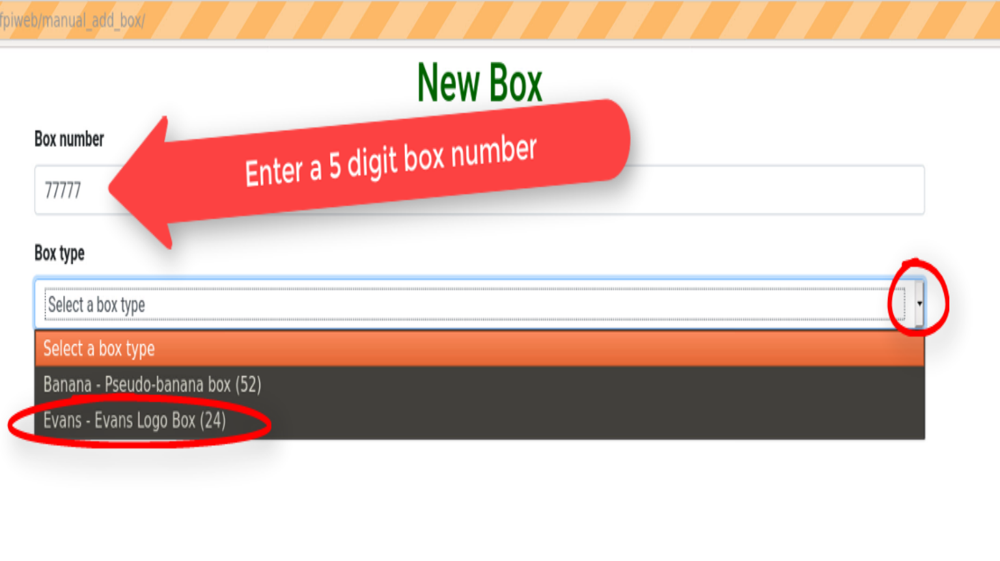

After clicking on **Add Box** you should see the following screen. From there you can
**Add another box** or **Return to Manual Box Menu** by clicking on the links in the
**New Box** screen.

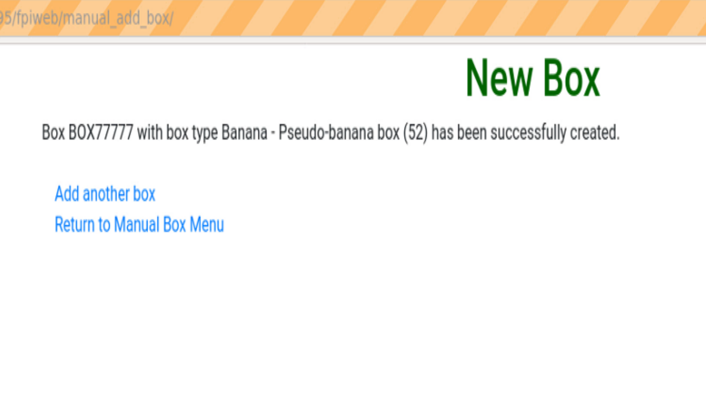

If there was an error you will see the following screen. Simply click on **Cancel Adding
a Box** to return to the **Manual Box Management** screen.

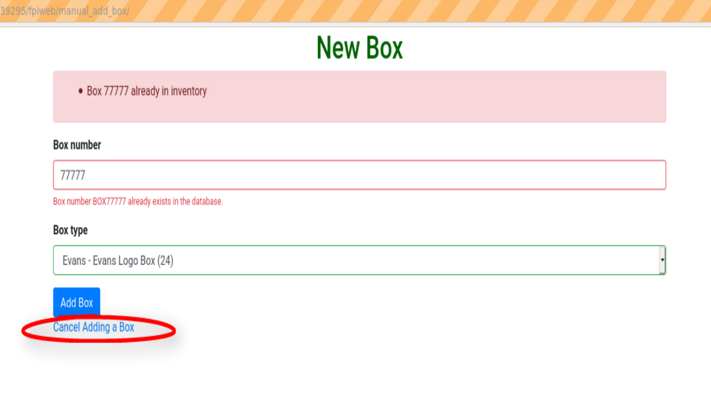

|

Checkin a Box Screen
=====================

With this screen you can add all the information needed to check in a box of food
items to warehouse inventory. The blank **Checkin Box** screen is shown below.

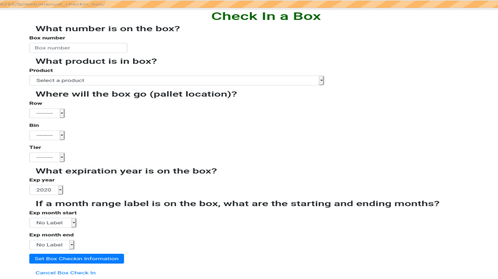

The first two items to enter are the **Box number** and **Product**. With the keyboard
enter a 5 digit 'Box number' in the **Box number** field. Then click on the small
triangle int the circle at the right of the **Product** drop down list to select a
product with your mouse.

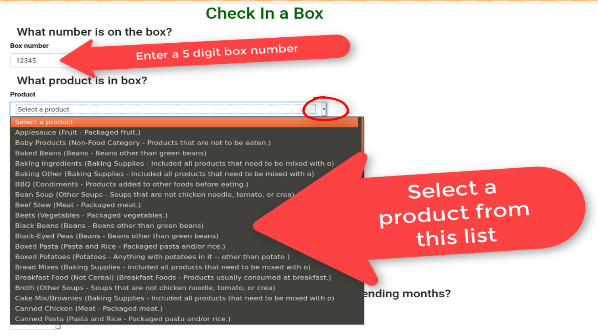

After entering the **Product** the next step is to  enter the pallet location.
You will have to select 3 different entries with your mouse.

    (1) Row number
    (2) Bin number ( Bin number in the length of a row)
    (3) Tier number (level up or down

Each entry uses a drop down list and you will make a choice from the drop down list.
In the graphic below the **Row** and **Bin** numbers have been chosen and the drop down
list is shown with the **Tier** number.

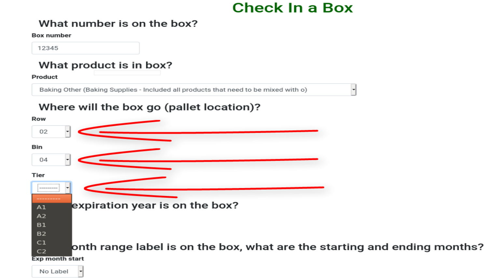

After entering the location enter the expiration year by clicking on the small triangle
to the right of the **Exp year** field and making a selection from the drop down list.

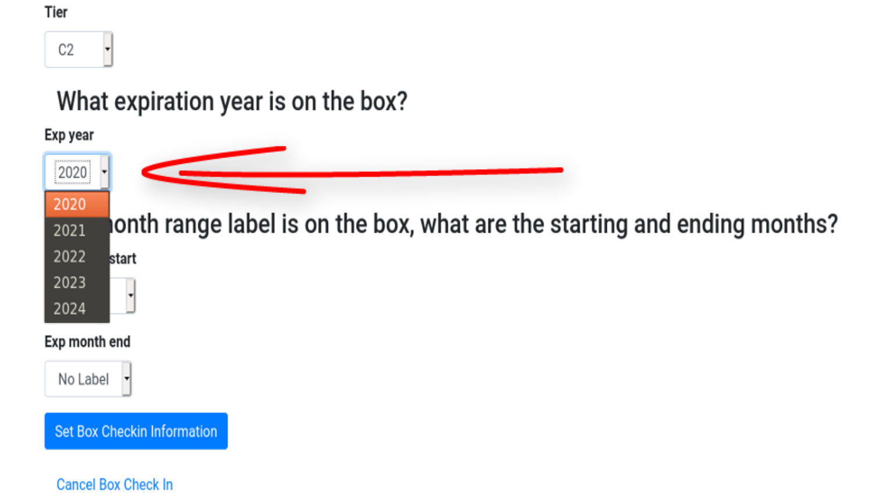

The last selection you will have to make is the expiration month. There are 2 drop down
list fields here **Exp month start** and **Exp month end**. These fields are optional and
it is not necessary to fill these fields out. These drop down lists show a list of all
the months in the year. You can also choose to **only** fill out the **Exp month start**
field also. However if you choose to fill out the **Exp month end** field you must make
sure it is a later month in the year than the **Exp month start** field. So if you enter
**April** in the **Exp month start** field, then you must enter **May** or a later month
in the **Exp month end** field.

When you are through with the **Exp month** fields click on the blue **Set Box Checkin
Information** button to enter all the Checkin data.

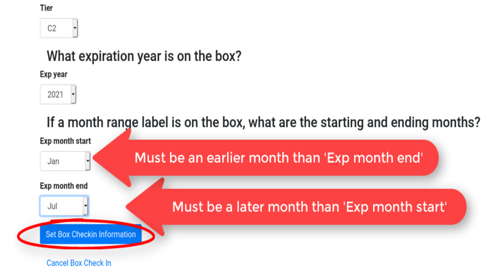

If everything has worked correctly you should see the following screen below. Simply click
on the **Return to Manual Box Menu** link to continue.

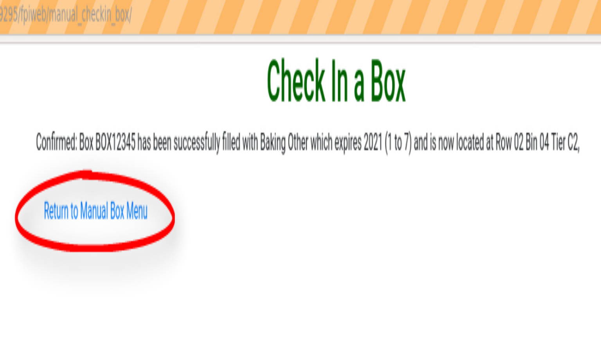

If there is an error you should see a screen like the one below. The
red arrows point to what has to be fixed before a box can be Checked in. Click on the
**Cancel Box Checkin** link at the bottom of the page to go back to the **Manual Box
Management** screen to start over.

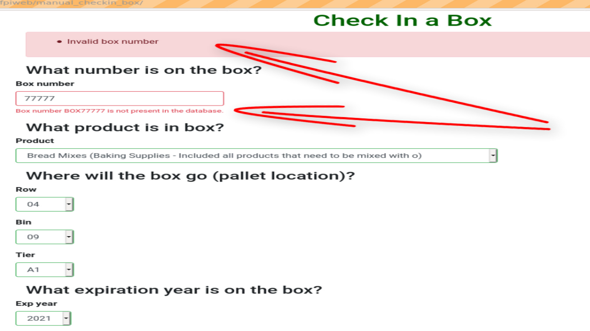

|

Consume (Empty) a Box Screen
=============================

To consume or empty a box enter a 5 digit box number in the **Box Number** field. Then
click on the blue **Search** button.

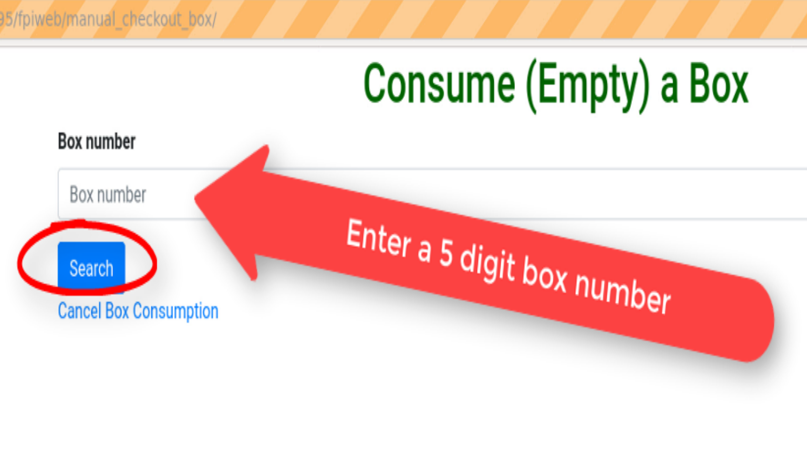

If everything went ok you should see the box information on the next screen. The box
information includes the Box Number, the Box Type, the Box Contents, the year the
Contents Expire and the location- Row, Bin, Tier. Click on the blue **Consume** button
to continue if all the information seems correct.

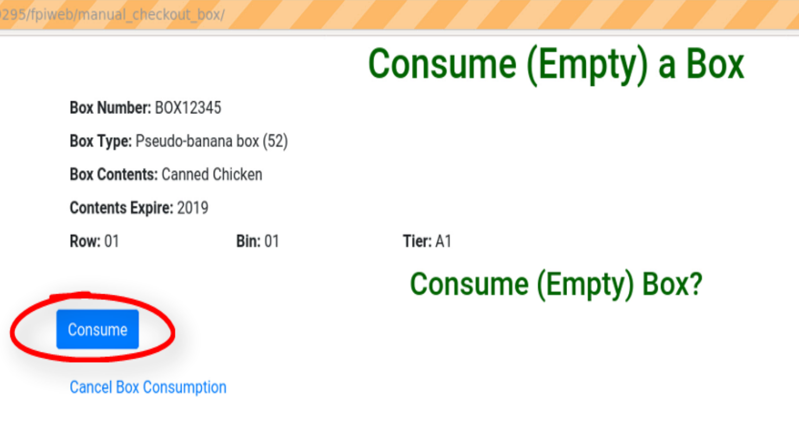

The next screen should contain a message stating that a box 'has been succesfully
consumed'. Click on the **Return to Manual Box Menu** link to return to the **Manual
Box Management** page.

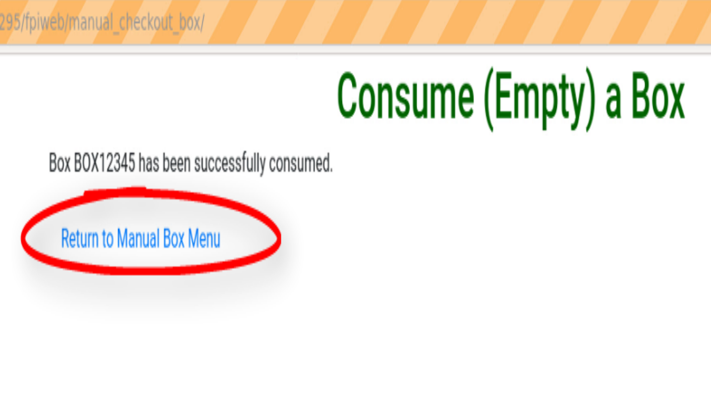

In case of error you should see a screen similar to the one below listing the error.
Click on the **Cancel Box Consumption** link to return to the **Manual Box Management**
page.

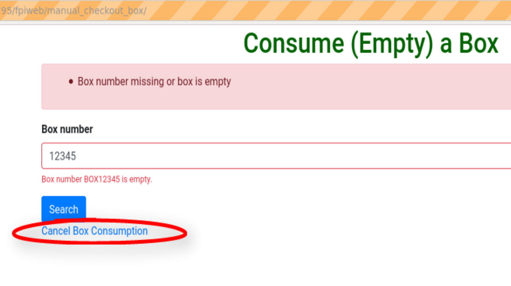

Move Box Screen
================

To move a box to a different pallet enter the 5 digit box number in the **Box Number**
field and then click on the blue **Search** button.

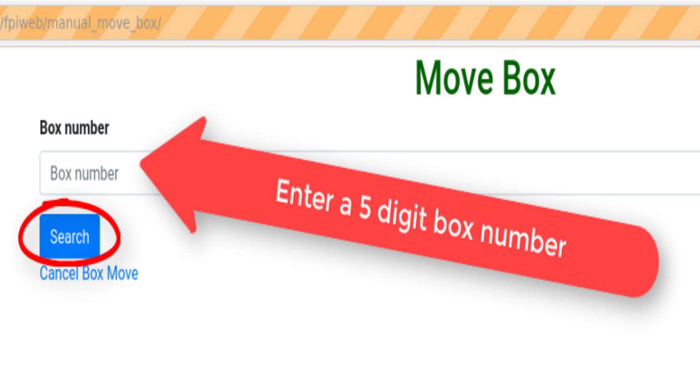

The next **Move Box** screen contains all the box information. In this screen
you can choose a new location by entering new **Row**, **Bin**, **Tier** locations. Click
on the small triangle to the right of each **Row**, **Bin**, **Tier** to get your drop down
list choices. After choosing your new location entries click on the blue **Move**
button to change the information in the database.

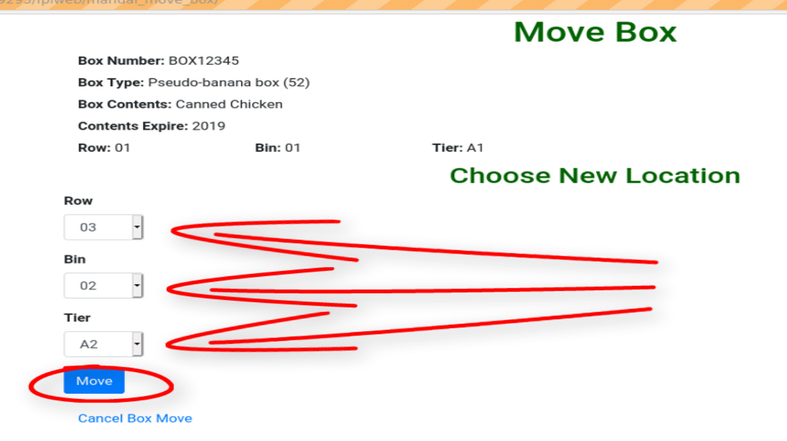

If there are no errors you should see a screen similar to the one below. Click on the
**Return to Manual Box Menu** link to return to the **Manual Box Management**
screen.

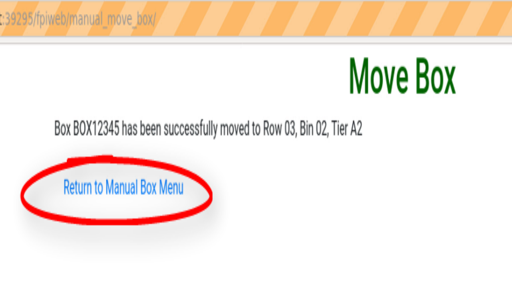

In case of error you will see a screen similar to the one below with an error message.
Click onthe **Cancel Box Move** link to return to the **Return to Manual Box Menu**.

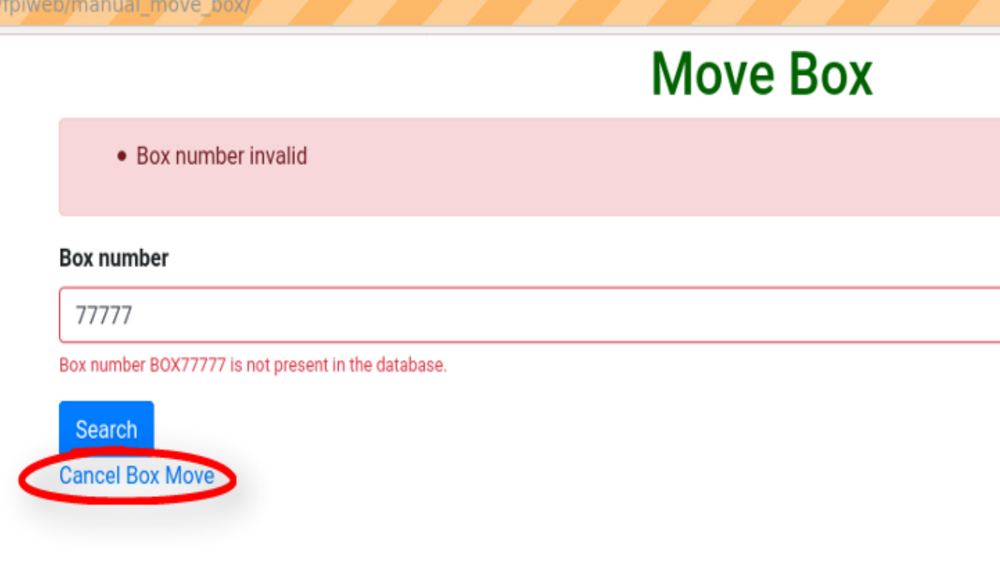
