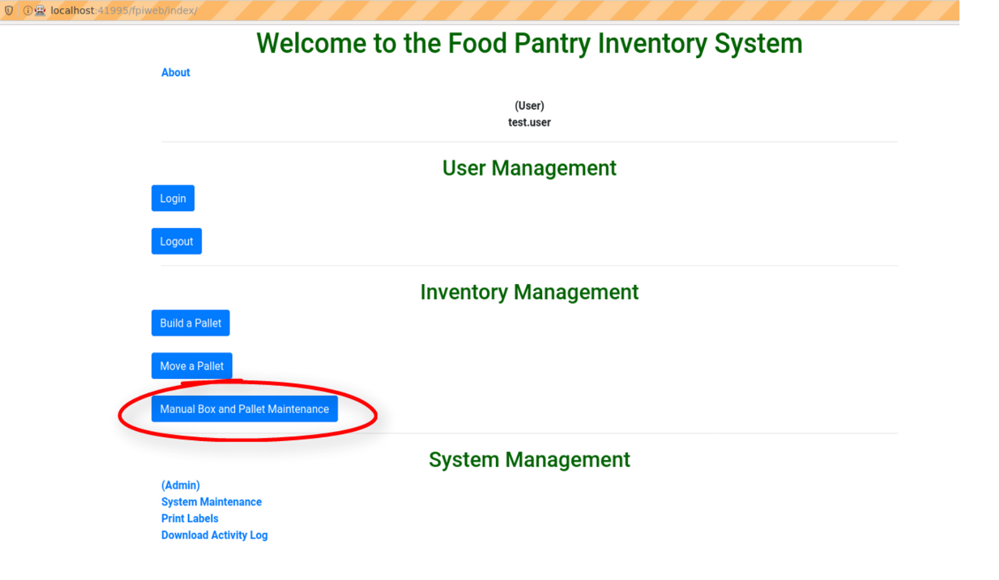

###########################
Individual Box Instructions
###########################

Describe how to manage individual boxes of product.

Start
++++++
After logging on click on **Manual Box and Pallet Maintence** as shown below to begin processing
a pallet. You will be directed to the **Manual Box and Pallet Management** screen.

Manual Box and Pallet Management Screen
++++++++++++++++++++++++++++++++++++++++

To continue to manage individual boxes of product click on **Manage an individual
box manually**.

.. image:: manual_box_images/ManageManualBox_0_00_19.png

Manual Box Management Screen
+++++++++++++++++++++++++++++

You will come to the **Manual Box Management** screen.

Here you will see 5 menu items.

+ Check the status of a box
+ Add a new box to inventory
+ Checkin a new box
+ Checkout (consume product in) a box
+ Move a box

Of course you can also 'Return to manual menu'. Each of the 5 menu items will be discussed
below.

Manual Status a Box Screen
+++++++++++++++++++++++++++

From Manual Box Management clicking on **Check the status of a box** will bring you to the
**Manual Status a Box** screen. Here you can check th box status by entering a 5 digit
box number and then clicking on the **Search** button.

.. image:: manual_box_images/ManualStatusABox_0_01_01.png

After clicking on the **Search** button you should see a screen listing the Box Number,
Box Type, Box Contents, Contents Expire (expiration date) and location- Row, Bin and Tier
number.

.. image:: manual_box_images/ManualStatusABox_0_01_06.png

From this screen you can click on **Check another box** or **Return to Manual Box Menu**.

New Box Screen
+++++++++++++++

This screen allows you to add a new box

.. image:: manual_box_images/ManualStatusABox_0_01_06.png

Checkin a Box Screen
++++++++++++++++++++++

Consume (Empty) a Box Screen
+++++++++++++++++++++++++++++

Move Box Screen
++++++++++++++++
