######################
Inventory Management
######################

Check Status of a Box
**************************

From the Inventory Management section on the Mainn screen clicking on
**Check Status of a Box** will bring you
to the **Manual Status a Box** screen. Here you can check the box status by entering a 5 digit
box number and then clicking on the **Search** button.

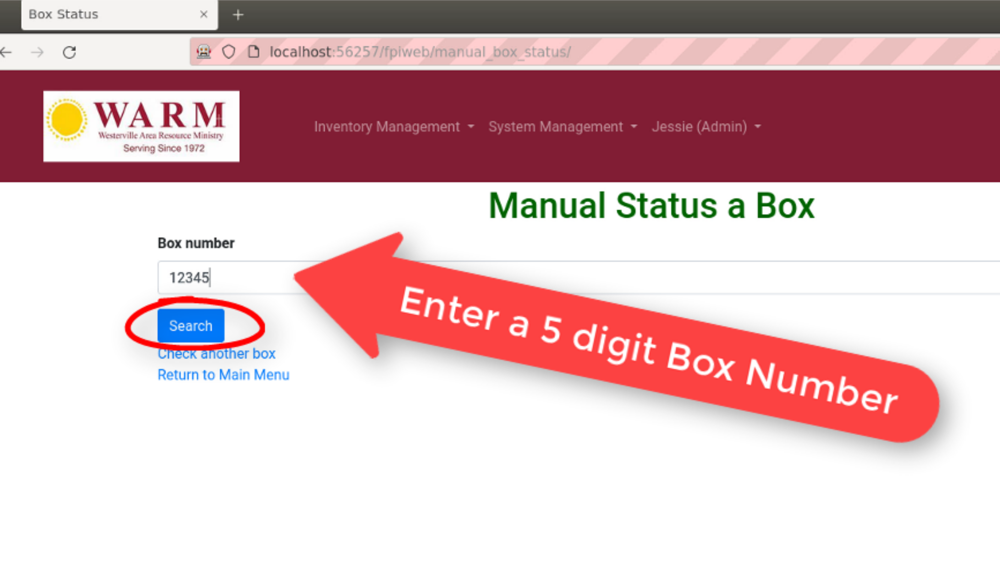

After clicking on the **Search** button you should see a screen listing the Box Number,
Box Type, Box Contents, Contents Expire (expiration date) and location- Row, Bin and Tier
number.

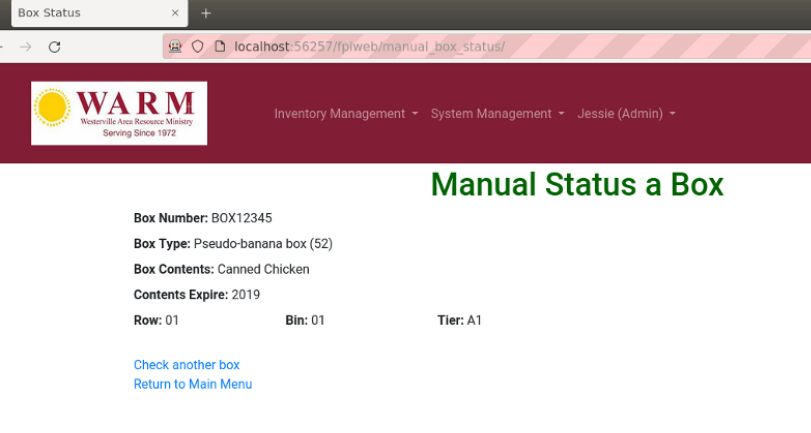

From this screen you can click on **Check another box** or **Return to Main Menu**.

If you see the screen below that means the **Box Number** is invalid or has not been entered
into inventory. In this screen you can enter a new **Box Number** and click
**Search** to see if the new **Box Number** works.

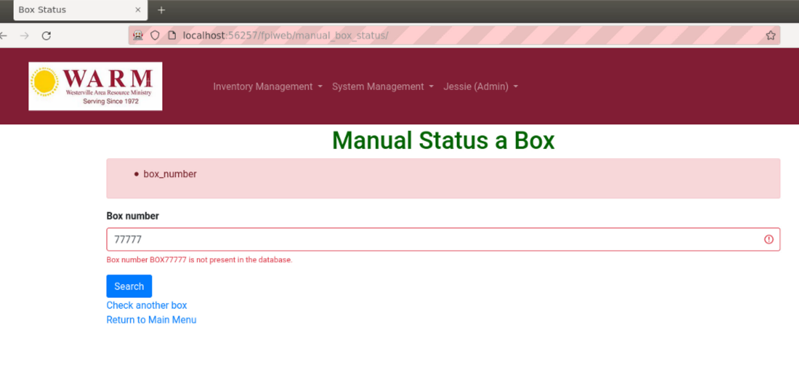

Check In a Box
**************

With this screen you can add all the information needed to check in a box of food
items to warehouse inventory. The blank **Checkin a Box** screen is shown below.

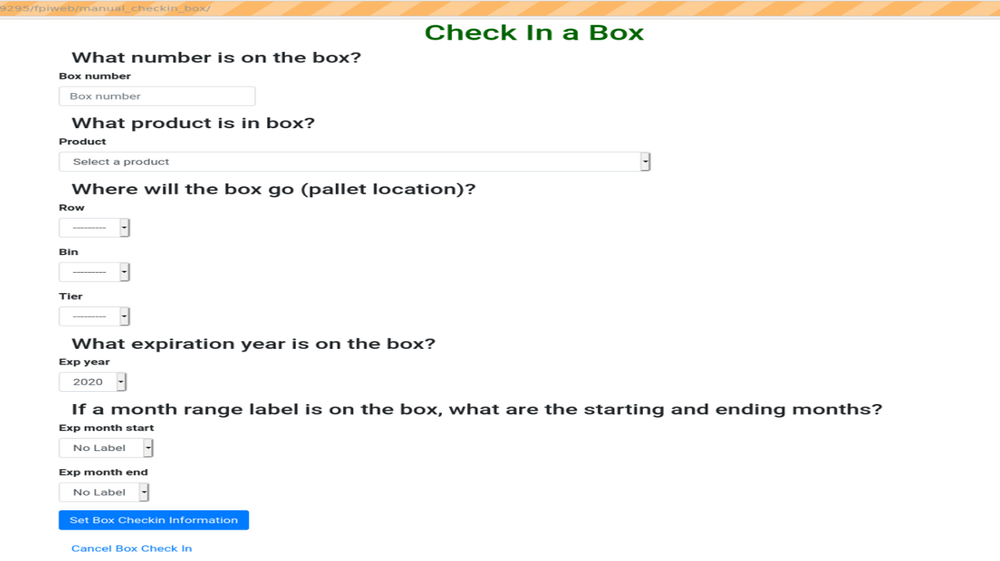

The first two items to enter are the **Box number** and **Product**. With the keyboard
enter a 5 digit 'Box number' in the **Box number** field. Then click on the small
triangle in the circle at the right of the **Product** drop down list to select a
product with your mouse.

.. image:: InventoryManagementImages/CheckinBoxSelectProduct_0_01_31.png

After entering the **Product** the next step is to  enter the pallet location.
You will have to select 3 different entries with your mouse.

    (1) Row number
    (2) Bin number ( Bin number in the length of a row)
    (3) Tier number (level up or down

Each entry uses a drop down list and you will make a choice from each drop down list.
In the graphic below the **Row** and **Bin** numbers have been chosen and the drop down
list is shown with the **Tier** number.

.. image:: InventoryManagementImages/CheckinBoxLocation_0_01_49.png

After entering the location enter the expiration year by clicking on the small triangle
to the right of the **Exp year** field and making a selection from the drop down list.

.. image:: InventoryManagementImages/CheckinBoxExpYear_0_01_55.png

The last selection you will have to make is the expiration month. There are 2 drop down
list fields here **Exp month start** and **Exp month end**. These fields are optional and
it is not necessary to fill these fields out. These drop down lists show a list of all
the months in the year. You can also choose to **only** fill out the **Exp month start**
field also. However if you choose to fill out the **Exp month end** field you must make
sure it is a later month in the year than the **Exp month start** field. So if you enter
**April** in the **Exp month start** field, then you must enter **May** or a later month
in the **Exp month end** field.

When you are through with the **Exp month** fields click on the blue **Set Box Checkin
Information** button to enter all the Checkin data.

.. image:: InventoryManagementImages/CheckinBoxExpMonth_0_02_08.png

If everything has worked correctly you should see the following screen below. Simply click
on the **Return to Main Menu** link to continue.

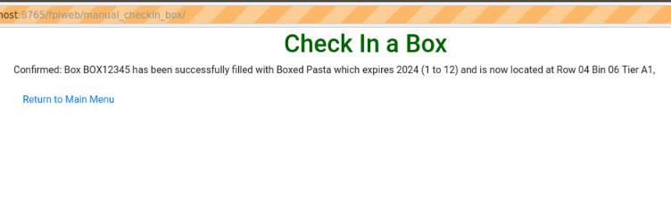

If there is an error you should see a screen like the one below. The
red arrows point to what has to be fixed before a box can be Checked in. Click on the
**Cancel Box Checkin** link at the bottom of the page to go back to the **Main Menu**
screen to start over.

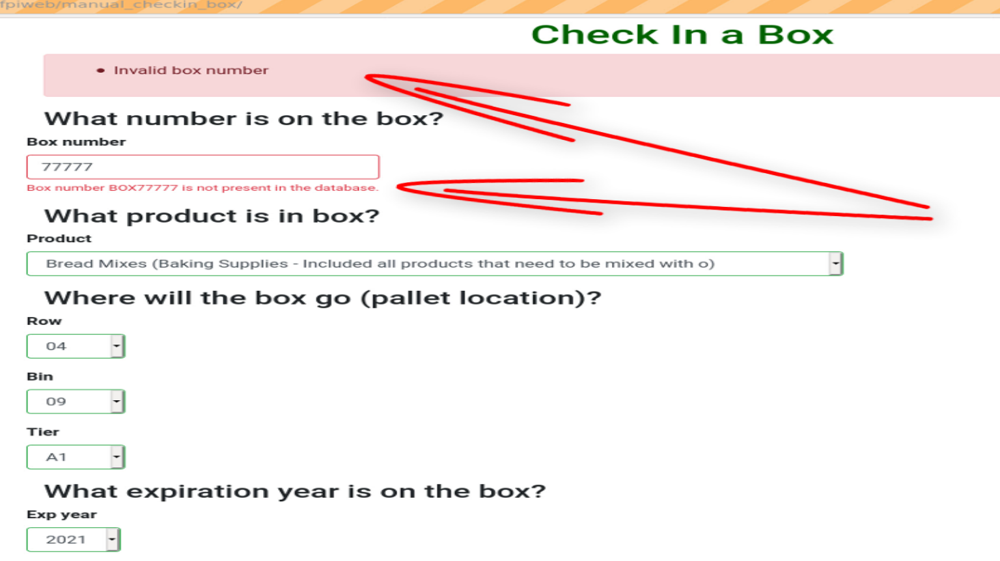

Checkout (Consume Product In) a Box
**************************************

To consume or empty a box enter a 5 digit box number in the **Box Number** field. Then
click on the blue **Search** button.

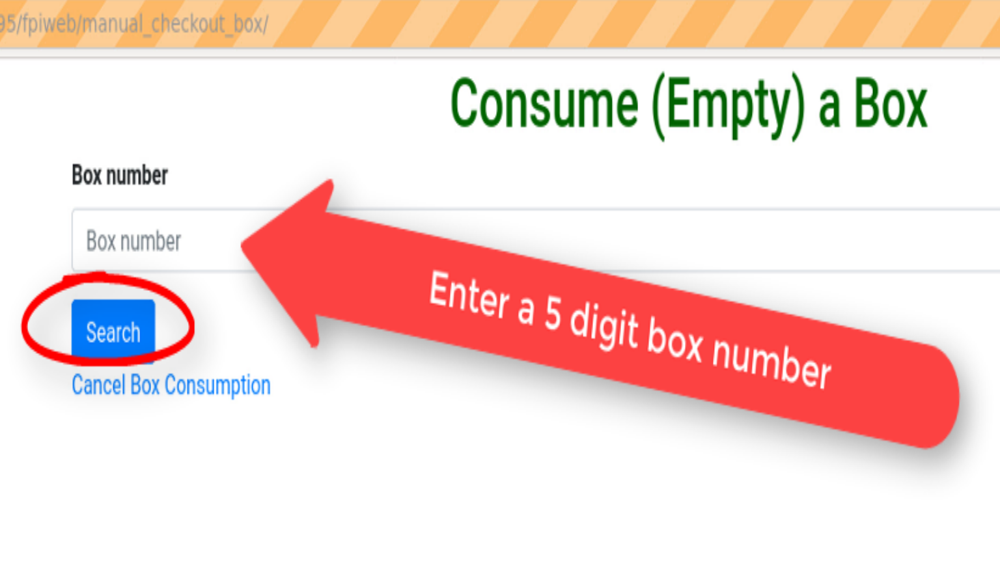

If everything went ok you should see the box information on the next screen. The box
information includes the Box Number, the Box Type, the Box Contents, the year the
Contents Expire and the location- Row, Bin, Tier. Click on the blue **Consume** button
to continue if all the information seems correct.

.. image:: InventoryManagementImages/ConsumeBoxMessage_0_03_22.png

The next screen should contain a message stating that a box 'has been succesfully
consumed'. Click on the **Return to Main Menu** link to return to the **Main Menu**
page.

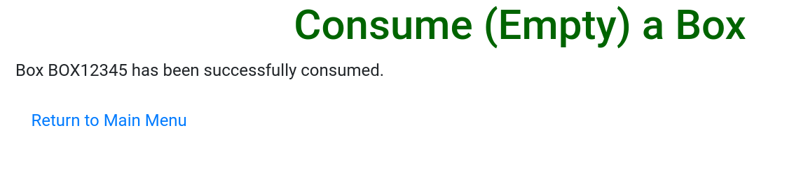

In case of error you should see a screen similar to the one below listing the error.
Click on the **Cancel Box Consumption** link to return to the **Main Menu Page**
page.

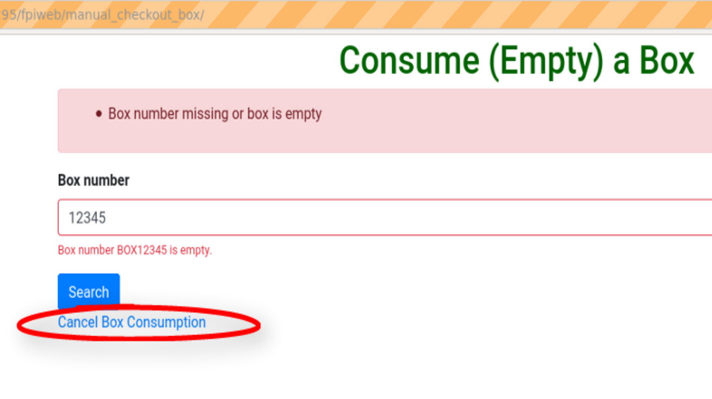

Move a Box
************

To move a box to a different pallet enter the 5 digit box number in the **Box Number**
field and then click on the blue **Search** button.

.. image:: InventoryManagementImages/MoveBox_0_03_55.png

The next **Move Box** screen contains all the box information. In this screen
you can choose a new location by entering new **Row**, **Bin**, **Tier** locations. Click
on the small triangle to the right of each **Row**, **Bin**, **Tier** to get your drop down
list choices. After choosing your new location entries click on the blue **Move**
button to change the information in the database.

.. image:: InventoryManagementImages/MoveBoxFillIn_0_04_19.png

If there are no errors you should see a screen similar to the one below. Click on the
**Return to Main Menu** link to return to the **Main Menu Page**
screen.

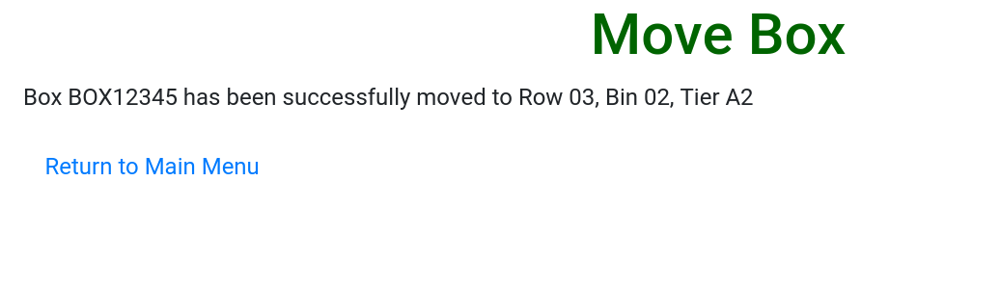

In case of error you will see a screen similar to the one below with an error message.
Click on the **Cancel Box Move** link to return to the **Main Menu** screen.

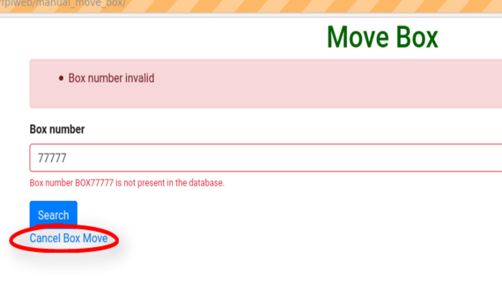

Add a New Box to Inventory
****************************

With this screen you can add a new box following the 4 steps listed below.

    (1) Enter a 5 digit box number.
    (2) Click on the drop down list triangle at the far right.
    (3) Choose an item from the drop down list.
    (4) Finally click on the **Add Box** button (hidden from view in the below graphic).

.. image:: InventoryManagementImages/AddNewBox_0_00_58.png

After clicking on **Add Box** you should see the following screen. From there you can
**Add another box** or **Return to Main Menu** by clicking on the links in the
**New Box** screen.

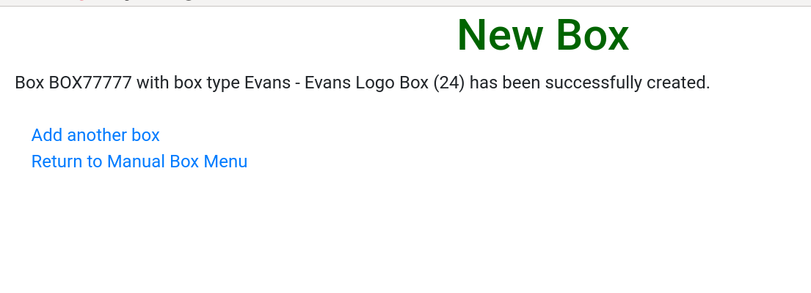

If there was an error you will see the following screen. Simply click on **Cancel Adding
a Box** to return to the **Main Menu** screen.

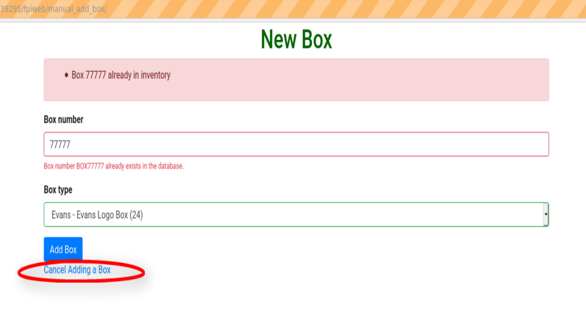

Build a Pallet
***************

The next screen you will see is the **Build Pallet** screen. Here you will have
two choices, **Select** or **Add**. **Select** gives you a choice of pallets
to work with. If there are no pallets in **Select**, you must create a new
pallet listing using **Add**.

Select
=======
To check if there are pallets that you can select click on the ‘Dropdown icon’
shown below. If there are pallets available you will see a drop down list as
shown below. Select one of the pallets from the drop down list.

If there are no pallets available nothing will show on the drop down list.
You will have to go the **Add** section.

.. image:: InventoryManagementImages/SelectPallet.png

After selecting a pallet click on the **Select** button to go to the
**Build Pallet** screen as shown below.

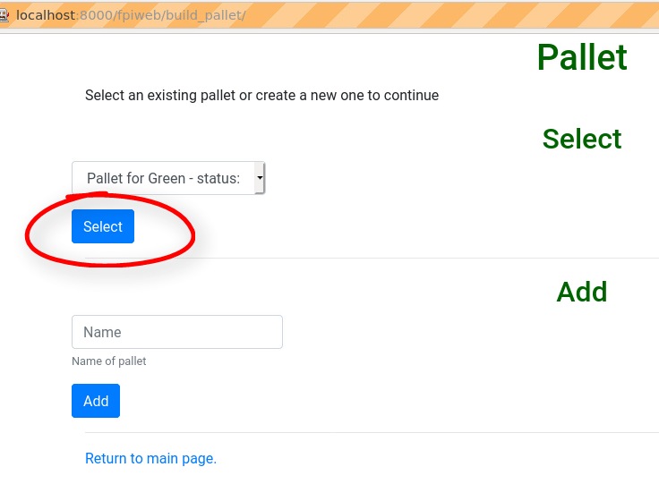

Add
====

Enter or key in a pallet name. In the screen below the pallet name
‘purple’ has been entered. You can pick any name you choose. After keying in
the new pallet name click on **Add** for the **Build Pallet** screen.

.. image:: InventoryManagementImages/AddPallet.png

Build Pallet Screen
====================

The next screen you will come to is the **Build Pallet** screen. On this
screen the first thing you should do is to create a location for the pallet.

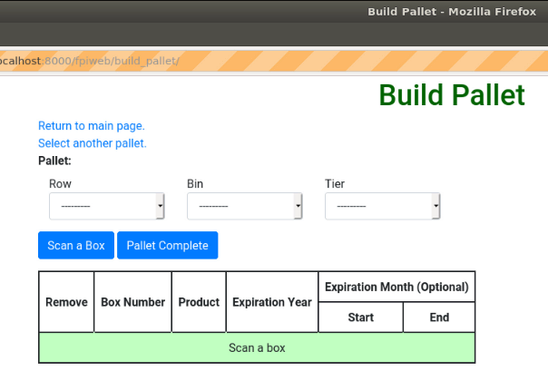

You will create the pallets location for ‘Row’, ‘Bin’ and ‘Tier’. Row refers to
which long row the pallet is on. Currently rows are 2 bins wide. Bin refers
pallet bins located down the length of the row. Tier refers to the height level
of the location. Use the drop down list boxes to enter ‘Row’, ‘Bin’ and ‘Tier’.

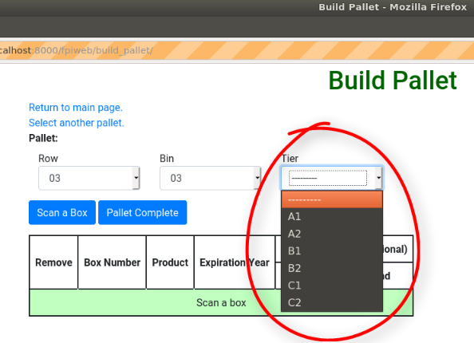

Once you have entered the pallet location, click on the **Scan a Box** button
in the middle of the **Build Pallet** page.

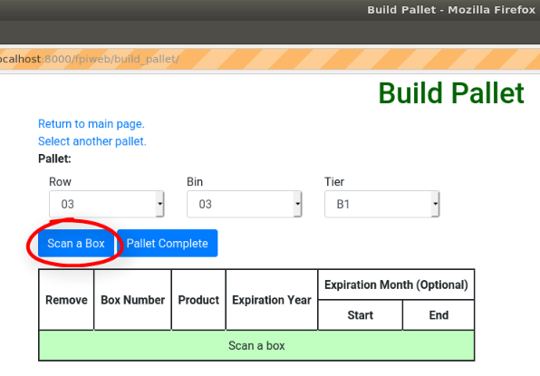

Scan a Box Popup
=================

You will be directed to a **Scan a Box** popup window. If your computer has a
camera you will be asked to enter a QR code. QR is short for Quick Response and
is simply a funny looking label that can be read by computers.

Scan a Box QR code popup (for computers with a camera)
---------------------------------------------------------

Use the camera on your computer to scan the QR code as shown below. Some
computers may request your permission to use the computer camera. You will
have to agree to the camera permission request to scan the QR code. In the
image below an individual is holding a scan code up to the computer camera.
With the QR code in the center of the ‘Picture Window’ click on the blue
**Scan** button at the bottom right.

Occasionally there may be a situation where the computer is unable to scan the
QR code, due to poor lighting or some other technical issue. In that case you
can always add the QR code manually be entering or keying in the 5 digit box
number manually in the pop up window at the bottom left. Then click the blue
**Scan** button at the bottom right.

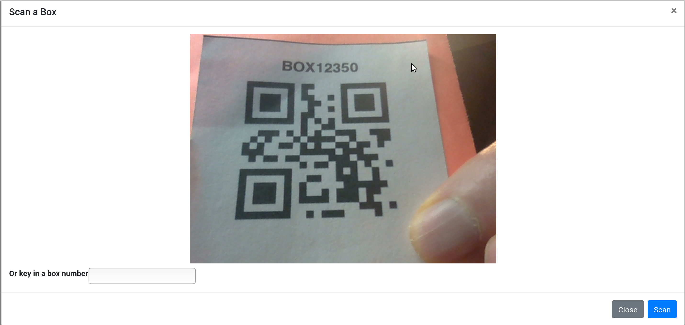

Scan a Box popup (for computers without a camera)
--------------------------------------------------

On this page you first have to enter or key in a 5 digit box number in the
bottom left of the screen. You can enter any number but it must contain exactly
5 digits. Once you have entered the number click on the **Scan** button in the
bottom right of the popup window.

.. image:: InventoryManagementImages/ScanBoxPopUp.png

Return to Build Pallet
=======================

After clicking on the **Scan Button** you will be returned to the **Build Pallet**
screen. You should see the ‘Box Number’ you have entered as well as a small
white ‘X’ in a red box at the left of your screen. On this screen you will
select a product to go in the box from a drop down product list. Click on
the ‘Dropdown icon’ at the bottom right of the ‘Product’ rectangle’. Then
choose an item from the list.

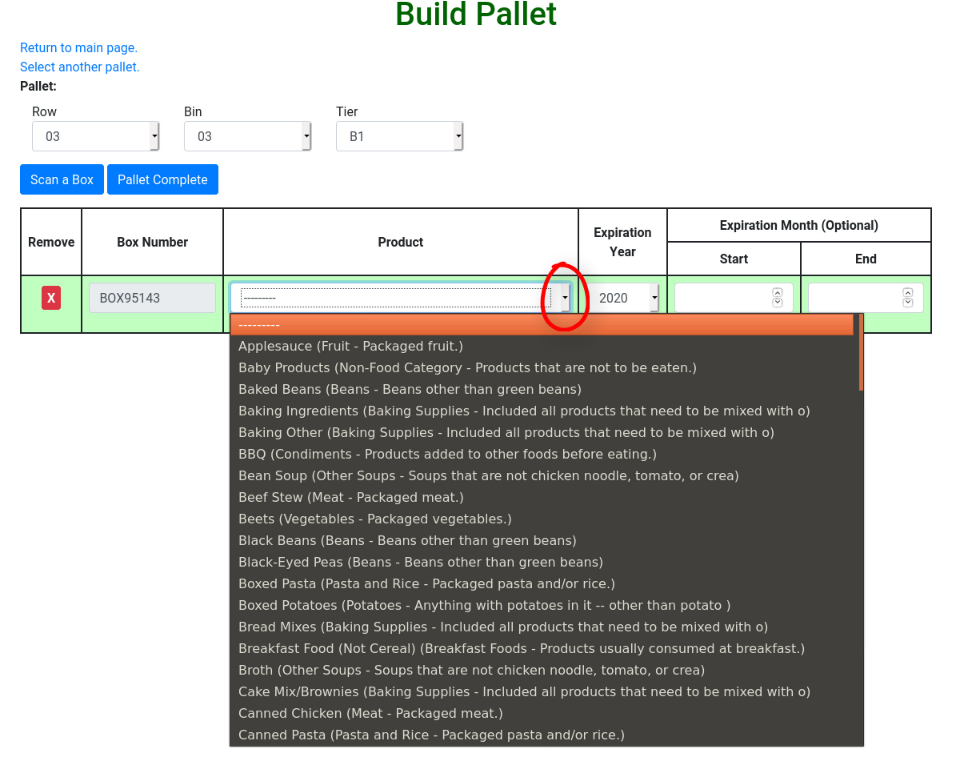

Once you have entered the product, use the ‘Expiration Year’ drop down list
to enter the ‘Expiration Year’.

Entering the ‘Expiration Month’ is optional. Months are entered from a drop
down list that holds numbers from 1 to 12 that correspond to the months of
the year- January to December. If you do decide to enter the ‘Expiration Month’
please make sure that the ‘Start’ month **is always less than** the ‘End’
month. This means the ‘End’ month **must not equal** the 'Start' month and
**must be greater than** the ‘Start’ month. *Not all food items will have
an ‘Expiration Month’ with a ‘Start’ and an ‘End’ month.* Once you have
entered everything on this page the page should look similar to what is below.

.. image:: InventoryManagementImages/PalletCompleteBefore.png

From here if you click on **Scan a Box** you will be directed back to the
**Scan a Box** popup window. There you can add another box in the same
manner as you did before. If you click **Pallet Complete** you will be
directed to the **Pallet Complete** screen.

.. image:: InventoryManagementImages/PalletCompleteScanBoxButtons.png

Pallet Complete
================

You should now see the **Pallet Complete** screen.

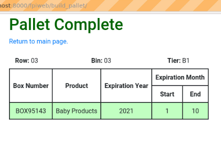

From here you can return to the main screen by clicking ‘Return to main page’.

Move a Pallet
**************

**Currently the Move Pallet screen has an error or bug in it. There is a link on
the Move Pallet screen which states 'Return to Manual Pallet Menu'. This link should
NOT be clicked and should be ignored. If you do not see this link then the bug has been
fixed but the User Documentation has not been updated.**

After clicking on **Move a Pallet** you should see a screen like the one below. This
screen allows you to move the location of each pallet along with its boxes in the
database records. Basically if you move a pallet you are also moving the boxes the pallet
contains.

.. image:: InventoryManagementImages/MovePalletStart_0_00_11.png

When moving a pallet (with its boxes) three different conditions can occur.

1. Move a pallet and its boxes to an empty pallet location.
#. Move a pallet and its boxes to non-empty pallet location.
#. Attempt to move an empty pallet with no boxes.

All three conditions will be shown below.

Move a Pallet to an Empty Pallet Location
==========================================

When moving a pallet and its boxes to a new location the first thing you need to
do is to "Enter location to move pallet from". You enter the position of the pallet
by selecting the Row, Bin, and Tier dropdown lists by using the mouse to click on the down
arrow at the right of each dropdown list. Selecting the down arrow as shown below in the
Row dropdown list brings a set of choices. Simply click on the current Row location choice
to "Enter the location to move pallet from".

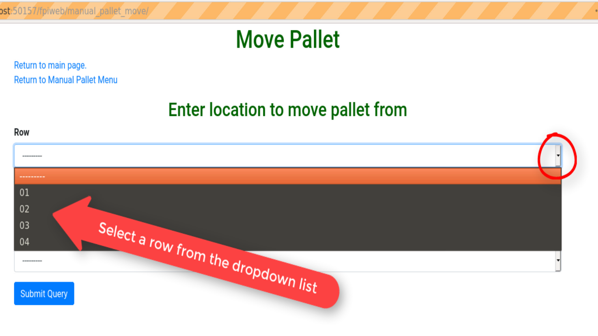

Do the same with the Row and Tier locations. Once that is done you should see the
**Move Pallet** screen as filled out below with Row, Bin, and Tier locations filled out.
Then click on the blue **Submit Query** button.

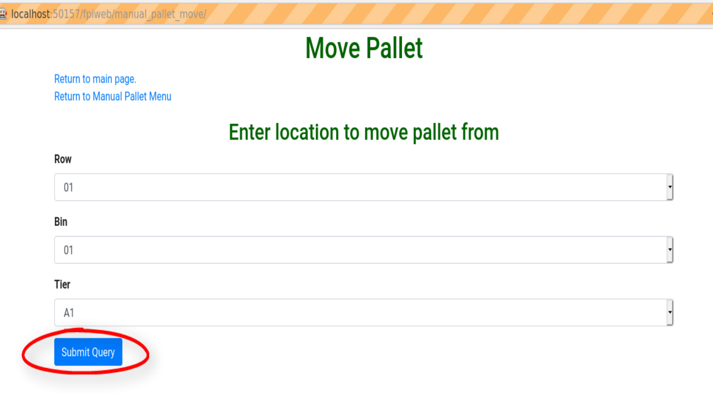

This will bring you to a similar screen but this new screen will say "Enter location
to move pallet **to**". Enter the Row, Bin, and Tier location for where the pallet
and it's boxes will be moved to. The screen below shows the new Tier location being
chosen.

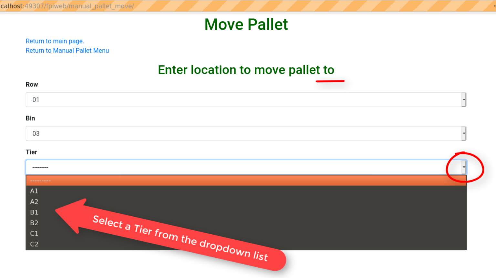

Once the **Enter location to move pallet to** screen has been filled out click on the
blue **Submit Query** button. If the new location you want to move the pallet is empty
and has no boxes you should see a screen similar to the one shown immediately below.

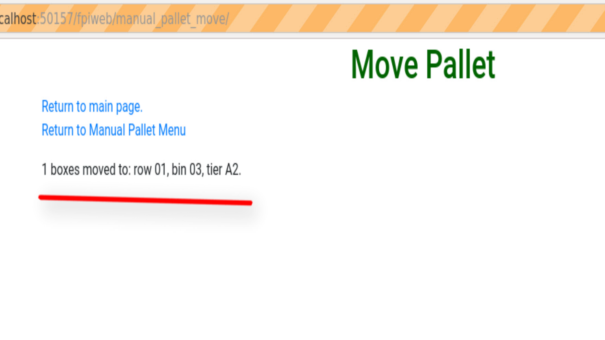

If the "Enter location to move pallet to" is NOT EMPTY then you will see a screen like
the one shown in the next section below.

Move a Pallet and Its Boxes to a Non-Empty Pallet Location
===========================================================

The screen below shows up when you try to move a pallet to a location where a pallet is
already located. Notice that the message states "There are 2 boxes at 01,03,C2".

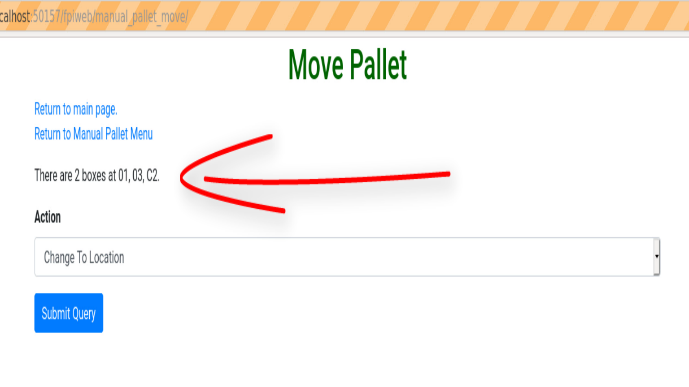

This means you will have to make a decision, either (1) choose a new location by clicking
the **Change To Location** choice or (2) merge the pallets by clicking the **Merge Pallets**
choice.

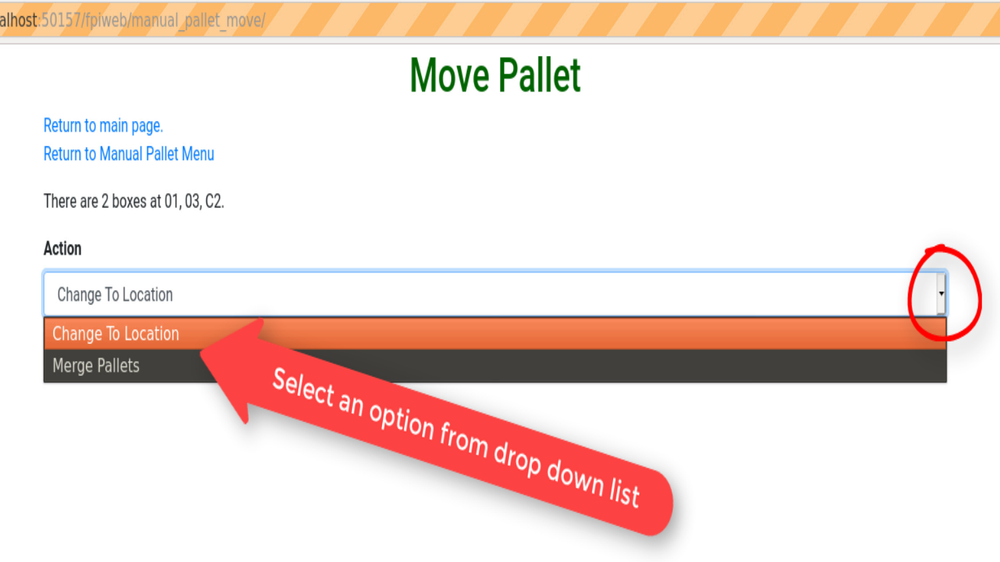

If you click on **Change to Location** you will be directed back to the **Enter location
to move pallet to** screen as shown above. From there you can select another location to
move the pallet to.

If you click on **Merge Pallets** both pallets along with their boxes will be merged
into the new location you picked from the **Enter location to move pallet to** screen.
You will see a screen stating "boxes move to row, bin, tier".

Attempt to Move an Empty Pallet
================================

If you attempt "Enter location to move pallet from" and there are no boxes recorded
in the database for that pallet location you will see a screen similar to the one shown
below.

.. image:: InventoryManagementImages/MoveEmptyPallet_0_03_01.png
