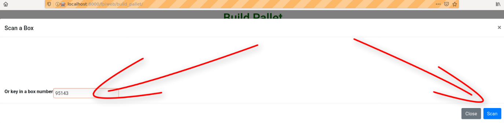

####################
Pallet Instructions
####################
Describes how to manage a pallet of product, including adding boxes to a pallet,
moving a pallet to an empty location, and moving boxes from one pallet onto a
pallet that already has boxes on it to another location.

Start
+++++
After logging on click on **Build a Pallet** as shown below to begin processing
a pallet.

Pallet Screen
++++++++++++++

The next screen you will see is the **Build Pallet** screen. Here you will have
two choices, **Select** or **Add**. **Select** gives you a choice of pallets
to work with. If there are no pallets in **Select**, you must create a new
pallet listing using **Add**.

Select
-------
To check if there are pallets that you can select click on the ‘Dropdown icon’
shown below. If there are pallets available you will see a drop down list as
shown below. Select one of the pallets from the drop down list.

If there are no pallets available nothing will show on the drop down list.
You will have to go the **Add** section.

After selecting a pallet click on the **Select** button to go to the
**Build Pallet** screen.

Add
____

Enter or key in a pallet name. In the screen below the pallet the pallet name
‘purple’ has been entered. You can pick any name you choose. After keying in
the new pallet name click on **Add** for the next screen.

Build Pallet Screen
++++++++++++++++++++

The next screen you will come to is the **Build Pallet** screen. On this
screen the first thing you should do is to create a location for the pallet.

You will create the pallets location for ‘Row’, ‘Bin’ and ‘Tier’. Row refers to
which long row the pallet is on. Currently rows are 2 bins wide. Bin refers
pallet bins located down the length of the row. Tier refers to the height level
of the location. Use the drop down list boxes to enter ‘Row’, ‘Bin’ and ‘Tier’.

.. image:: pallet_images/LocatePallet.png

Once you have entered the pallet location, click on the **Scan a Box** button
in the middle of the **Build Pallet** page.

You will be directed to a **Scan a Box** popup window. If your computer has a
camera you will be asked to enter a QR code. QR is short for Quick Response and
is simply a funny looking label that can be read by computers.

Scan a Box QR code popup (for computers with a camera)
-------------------------------------------------------

Use the camera on your computer to scan the QR code as shown below. Some
computers may request your permission to use the computer camera. You will
have to agree to the camera permission request to scan the QR code. In the
image below an individual is holding a scan code up to the computer camera.
With the QR code in the center of the ‘Picture Window’ click on the blue
**Scan** button at the bottom right.

Occasionally there may be a situation where the computer is unable to scan the
QR code, due to poor lighting or some other technical issue. In that case you
can always add the QR code manually be entering or keying in the 5 digit box
number manually in the pop up window at the bottom left. Then click the blue
**Scan** button at the bottom right.

Scan a Box popup (for computers without a camera)
-----------------------------------------------------------

On this page you first have to enter or key in a 5 digit box number in the
bottom left of the screen. You can enter any number but it must contain exactly
5 digits. Once you have entered the number click on the **Scan** button in the
bottom right of the popup window.

Return to Build Pallet
++++++++++++++++++++++++
After clicking on the **Scan Button** you will be returned to the **Build Pallet**
screen. You should see the ‘Box Number’ you have entered as well as a small
white ‘X’ in a red box at the left of your screen. On this screen you will
select a product to go in the box from a drop down product list. Click on
the ‘Dropdown icon’ at the bottom right of the ‘Product’ rectangle’. Then
choose an item from the list.

Once you have entered the product, use the ‘Expiration Year’ drop down list
to enter the ‘Expiration Year’.

Entering the ‘Expiration Month’ is optional. Months are entered from a drop
down list that holds numbers from 1 to 12 that correspond to the months of
the year- January to December. If you do decide to enter the ‘Expiration Month’
please make sure that the ‘Start’ month **is always less than** the ‘End’
month. This means the ‘End’ month **must not equal** the 'Start' month and
**must be greater than** the ‘Start’ month. *Not all food items will have
an ‘Expiration Month’ with a ‘Start’ and an ‘End’ month.* Once you have
entered everything on this page the page should look similar to what is below.

From here if you click on **Scan a Box** you will be directed back to the
**Scan a Box** popup window. There you can add another box in the same
manner as you did before. If you click **Pallet Complete** you will be
directed to the **Pallet Complete** screen.

Pallet Complete
++++++++++++++++

You should now see the **Pallet Complete** screen.

From here you can return to the main screen by clicking ‘Return to main page’.

