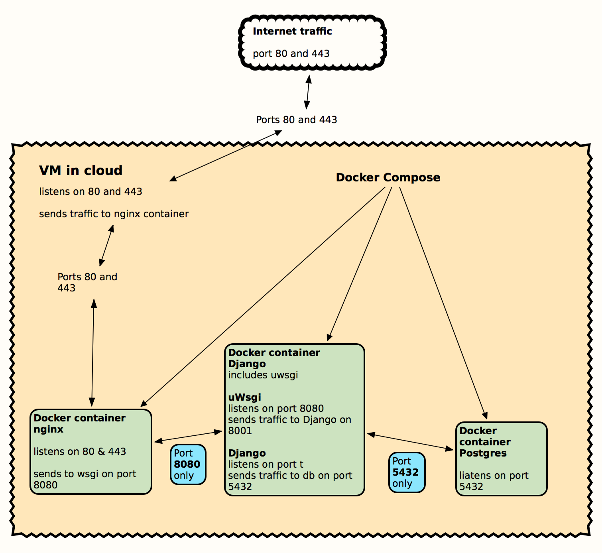

.. default-domain:: rst

##########################
ReStructured Text Examples
##########################

This document contains examples of some of the techniques used by
reStructuredText (_`rST`) to enhance the plain text of
the documentation. Although other references will describe additional
markup syntax, the examples given here have been vetted to work as expected
after being processed by Sphinx (at least with Sphinx 2.2.4).  A single page
`cheatsheet <https://docutils.sourceforge.io/docs/user/rst/cheatsheet.txt>`_
is also available.

Note that some `rST`_ editors, such as PyCharm,
ReText, etc. may not understand or display markup in the same way that
Sphinx does. They might display error messages that end up being bogus.  The
final Sphinx output will be correct.

Headings
========

Headings in `rST`_ act the same way as HTML headings.

Here is an example of how the level 1 heading above was coded::

    ##########################
    ReStructured Text Examples
    ##########################

Suggested list of Python heading levels:

======  ==========  =========  =====  =====================
Symbol  Name        Overline?  Level  Description
======  ==========  =========  =====  =====================
#       pound sign  yes        1      for parts
\*      asterisk    yes        2      for chapters
=       equal       no         3      for sections
\-      dash        no         4      for subsections
^       circumflex  no         5      for subsubsections
"       quote       no         6      for titled paragraphs
======  ==========  =========  =====  =====================

All of the headers are aligned with the left margin when using the
Read-The-Docs theme.

Paragraphs
==========

Each paragraph must be preceded by a blank line.  Each line of a paragraph
must immediately follow the preceding line.  A blank line indicates the
start of a new paragraph.

This is a paragraph before processing::

    Each line of a paragraph
    should be less than 80 characters.  This is more of
    a Python convention.  PyCharm can be set to automatically wrap as you
    type.  Sphinx will automatically rewrap the lines to fit the current
    margin so don't be concerned if you it looks
    "ugly" when editing causes
    lines to split.  Other markdown editors might not let you set the line
    length to be that short.

and after:

Each line of a paragraph
should be less than 80 characters.  This is more of
a Python convention.  PyCharm can be set to automatically wrap as  you
type.  Sphinx will automatically rewrap the lines to fit the current
margin so don't be concerned if you it looks
"ugly" when editing causes
lines to split.  Other markdown editors might not let you set the line
length to be that short.

If the short lines need to be preserved (e.g. a poem [#]_) code it with a
vertical bar followed by a spce like this::

    | "You are old, Father William," the young man said,
    |     "And your hair has become very white;
    | And yet you incessantly stand on your head—
    |     Do you think, at your age, it is right?"
    |
    | "In my youth," Father William replied to his son,
    |     "I feared it might injure the brain;
    | But now that I'm perfectly sure I have none,
    |     Why, I do it again and again."

and is displayed like this:

| "You are old, Father William," the young man said,
|     "And your hair has become very white;
| And yet you incessantly stand on your head—
|     Do you think, at your age, it is right?"
|
| "In my youth," Father William replied to his son,
|     "I feared it might injure the brain;
| But now that I'm perfectly sure I have none,
|     Why, I do it again and again."

Inline markup
=============

Blah blah ``*italics*`` = *italics*, ``**bold**`` = **bold**.  Text inside
double backticks is displayed literally.  See `Literal Text`_ below.

Images
======

Images can be added to the documentation with this syntax::

    .. image:: DevDocs/DeploymentOverview.png

which will be displayed like this:

Image notes:

*   Image file names that include spaces should be avoided.
*   Images are always separate files and can be in the same directory or in
    a subdirectory of this rST_ file.
*   The images will be resized to fit the page width.
*   When creating an image, save it as a ".png" file.

    *   If available, create a copy of the image as a ".pdf" file.  Then use
        an astrisk as a suffix for the file name, e. g. <imageName>.* in
        the image directive above.  This allows the HTML builder choose the
        .png file while the PDF builder will choose the .pdf file.
*   For now put the image files in the same directory as this text file.
    Later, they will be collected into a subdirectory and these image
    directives will be adjusted accordingly.

Lists
=====

Lists can be numbered, bulleted, or mixed.

Numbered List Example
---------------------

This is a numbered list::

    4. Numbered items (need not start at 1.)
    #. Numbered items (indent 4 spaces)
    #. Period can be replaced by a dash, right paren, etc., but is required.
    #. Must have a blank line before and after the list

        *   A numbered list can have numbered or bulleted subitems.  This
            one is bulleted.
        *   Subitems must be preceded and followed by a blank line like this.

    #.  Long lines can wrap.  The subsequent lines must be aligned with the
        start of text of the bulleted or numbered item.

        #.  This shows a numbered sublist.

which looks like:

4. Numbered items (need not start at 1.)
#. Numbered items (indent 4 spaces)
#. Period can be replaced by a dash, right paren, etc., but is required.
#. Must have a blank line before and after the list

    *   A numbered list can have numbered or bulleted subitems.  This
        one is bulleted.
    *   Subitems must be preceded and followed by a blank line like this.

#.  Long lines can wrap.  The subsequent lines must be aligned with the
    start of text of the bulleted or numbered item.

    #.  This shows a numbered sublist.

Bulleted List Example
---------------------

This is a bulleted list::

    - Bulleted items (can start with "-", "*" or "+".

    - Bulleted items

        - sublist items (indent 4 spaces)

    - Must have a blank line before and after the list

which looks like this:

- Bulleted items (can start with "-", "*" or "+".

- Bulleted items

    - sublist items (indent 4 spaces)

- Must have a blank line before and after the list

.. note::
    For both numbered and bulleted lists, a blank line can be added
    between each item or subitem at the same level if desired.  Any subitems must
    have a blank line both before and after the group of subitems.  Continuation
    lines however, must immediately follow the item being continued to be
    properly rewrapped by Sphinx.

Literal text
============

Literal Text Block
------------------

A literal text block coded like this:

\:\:

    literal text
    ...

    more text
        indented text

looks like this:

::

    literal text
    ...

    more text
        indented text

Note that literal text starts with two colons and a blank line both before
and after the colons.  All text that is part of theliteral block must be
indented.

An alternative is to put the two colons at the end of the preceding
paragraph.  If the two colons are adjacent to the last character of the
paragraph, they will be rendered as a single colon.  If there is a space
before the two colons, they will not appear in the final output.

Literal text can have lines that are indented further and also blank lines
interspersed.  However, text indented the same or less than the "::" marker
(or the text of the paragraph) ends the literal text.

Inline Literal Text
-------------------

Any text surrounded by double backticks is displayed as is, and in a
different font.

Embedded literal text coded like this::

    A sentence with ``:> GoOfY text :)`` in it.

looks like this:

    A sentence with ``:> GoOfY text :)`` in it.

Tables
======

Simple Table
------------

A simple Table coded like this::

    ============   ========================
    Cell Title     Another Cell  Title
    ============   ========================
    contents       more contents
    item 1         item 2
    green          purple
    ============   ========================

is rendered list this:

============   ========================
Cell Title     Another Cell  Title
============   ========================
contents       more contents
item 1         item 2
green          purple
============   ========================

If a cell needs to span rows or columns use the grid table format instead.

Grid Table
----------

A grid table coded like this::

    ..  table:: Sample Grid Table

        +----------------+--------------+--------------+
        | Header Col 1   | Header 2     |   Centered   |
        | Extended       |              |   Header     |
        +================+==============+==============+
        | Body 1         |   Body 2     |       Body 3 |
        +----------------+--------------+--------------+
        | Left Just      |   Centered   |   Right Just |
        +----------------+--------------+--------------+
        | This entry spans these cols   | This entry   |
        +----------------+--------------+ spans rows   +
        | Blah           | Blah         |              |
        +----------------+--------------+--------------+

is rendered like this:

..  table:: Sample Grid Table

    +----------------+--------------+--------------+
    | Header Col 1   | Header 2     |   Centered   |
    | Extended       |              |   Header     |
    +================+==============+==============+
    | Body 1         |   Body 2     |       Body 3 |
    +----------------+--------------+--------------+
    | This entry spans these cols   | This entry   |
    +----------------+--------------+ spans rows   +
    | Blah           | Blah         |              |
    +----------------+--------------+--------------+

Notes:

*   Text in the cell can be wrapped.  The table will be expanded if possible
    and the text in each cell will be rewrapped as needed.
*   The "``..  table:: Sample Grid Table``" line is completely optional.  If
    given, it will provide a title to the table (as shown).  If given,
    the table must be indented under it.

Links
=====

Links are created by a single backtick (accent grave) on each side of the
link.  A single underscore immediately before the trailing backtick
identifies it as the definition, while a reference is created by putting the
underscore immediately before the first backtick.

External URL Links
------------------

External link is coded like this:

::

    `Apple main web site <http://www.apple.com>`_

and is rendered like this in a paragraph.

Create a ink to an external URL, such as the
`Apple main web site <http://www.apple.com>`_, anywhere you desire.

The actual URL is wrapped with the "<" and ">" characters.  If a title for
the URL is desired, it must be specified between the initial backtick and the
less than symbol.  There must be a space between the title and the less than
symbol.

Internal Links
--------------

Reference to arbitrary text elswhere in the same document is accomplished by
identifying a source location (which rST documentation calls a target) then
making a reference to it elsewhere in the same or other document.

Source (target) of a reference::

    _`Link to elsewhere`           (multiple words)

    _`document`                    (single word)

Reference to a source::

    `Link to elsewhere`_

    document_                      (note lack of backticks)

In context a _`link to elsewhere` in the same _`document` can be referenced
with `link to elsewhere`_ in the document_.  See `Cross-References`_ below.

A link to headers in the same document such
as `ReStructured Text Examples`_ and Links_ can be easily referenced since
Sphinx automatically creates links out of all headers.  Headers can be in
some other rST_ document, such as :ref:`DeveloperDocumentation` can also be
referenced if the header to be referenced is given additional markup.

Links to glossary terms can be imbeded in a paragraph uaing the syntax::

    blah blah :term:`Glossary-type definition` blah blah

Links to glossary terms, such as :term:`Glossary-type definition`, can
also be easily made.

..  note::
    Every reference to a target must be spelled exactly the same --
    including capitalization!

Transitions or Horizontal Rules
===============================

A transition (or horizontal rule) is coded as::

    ----

and shows up like this:

----

A transition should not begin or end a section or document, nor should two
transitions be immediately adjacent.

Glossary Definitions
====================

A glossary definition like this::

    ..  glossary::

        Glossary-type definition
            The definition for the term must be indented and immediately below
            the term.

            Blank lines may appear in the definition body, but must not
            come between the term and the first line of definition.

            The term defined can be referenced elsewhere as shown above.

            Each glossary term header must be preceded by a blank line.

        reStructuredText
            This is plain text with a minimal amount of annotation.  This allows
            program (such as Sphinx) to process the text and use the annotations
            as clues to how detect headings, tables, cross-references, etc. so
            that web pages, PDFs, epubs and other formal documentation can be
            created from the original text.

will be formated like this:

..  glossary::

    Glossary-type definition
        The definition for the term must be indented and immediately below
        the term.

        Blank lines may appear in the definition body, but must not
        come between the term and the first line of definition.

        The term defined can be referenced elsewhere as shown above.

        Each glossary term header must be preceded by a blank line.

    reStructuredText
        This is plain text with a minimal amount of annotation.  This allows
        program (such as Sphinx) to process the text and use the annotations
        as clues to how detect headings, tables, cross-references, etc. so
        that web pages, PDFs, epubs and other formal documentation can be
        created from the original text.

Notes
=====

Short paragraphs with special offsets or formatting for emphasis can be created
by using this notation::

    .. note::
        This is a noteworthy comment.

which displays like:

.. note::
    This is a noteworthy comment.

Comments about this kind of markup.

    *   The text of the note musb be indented at least three spaces and can
        be more (as shown).
    *   Instead of the word "note", other words such as "caution",
        "hint", "important", "tip",
        "attention", "danger", "error" and "warning" can be used.
    *   Sphinx with the "Read the Docs" theme renders these with different
        colors in html.

        *   Notes are shown with a blue background.
        *   Hints, tips and importants are shown in green.
        *   Attentions, cautions and warnings are shown with a brown
            background.
        *   Error and danger are shown with a pink background.

    *   The pdf output from Sphinx with the "Read the Docs" theme sets these
        off differently.

Substitutions
=============

Today's date will be added to the by using ``|today|`` like this |today|.

Cross-References
================

This section shows examples of how to refer to arbitrary text that is some
distance away from this part of the document.

This is a reference to the `link to elsewhere`_ in this document_ written
using rST_.

Summary
=======

This document is a sampling of the rich formatting that can enhance plain
text.  The
`reStructuredText <https://docutils.sourceforge
.io/docs/ref/rst/restructuredtext.html#implicit-hyperlink-targets>`_
and
`Sphinx <http://www.sphinx-doc.org/en/stable/contents.html>`_ documentation
provide many more ways to subtly markup the text than what is shown here.

The original plain text -- as much as possible -- is still very readable,
while a processing program such as Sphinx can create a web site or PDF with
beautiful output, lots of cross-references, a table of contents and an index.

.. rubric:: Footnotes

.. [#] Poem by Lewis Carroll in `Alice in Wonderland <https://en.wikipedia
   .org/wiki/You_Are_Old,_Father_William>`_.
