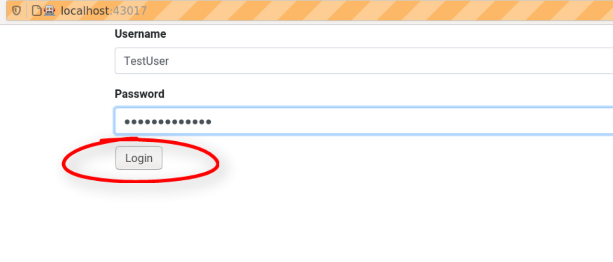
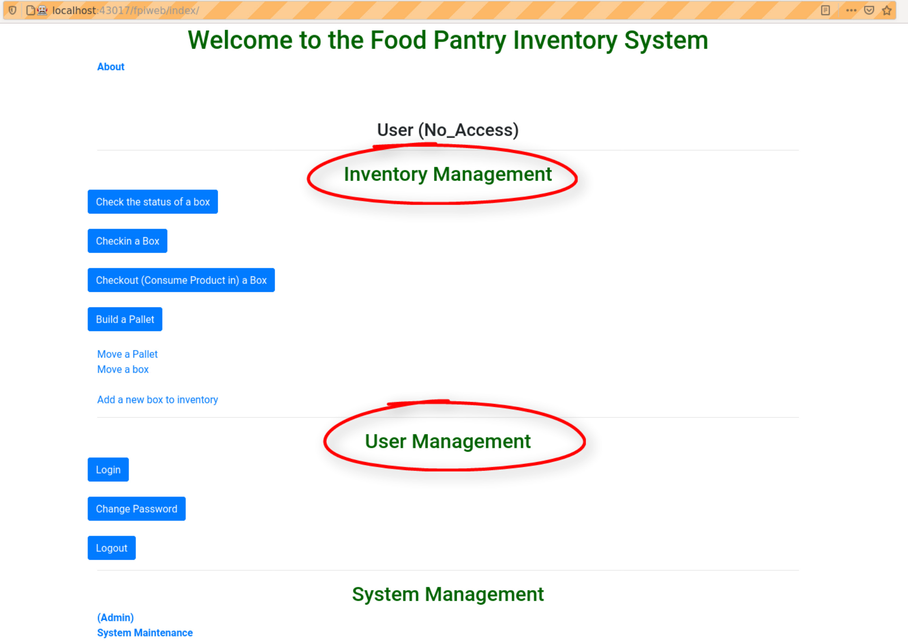
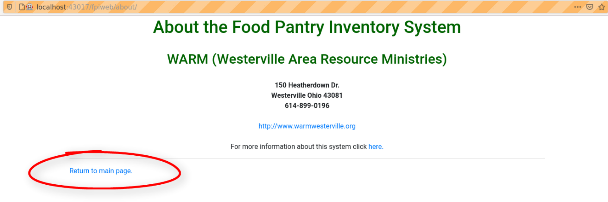
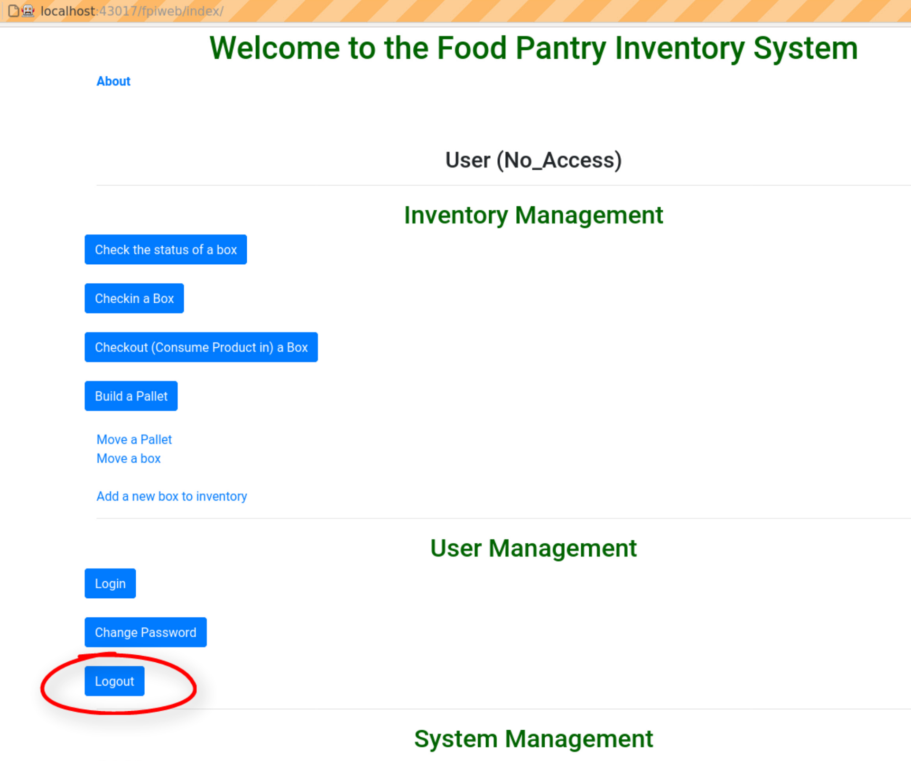
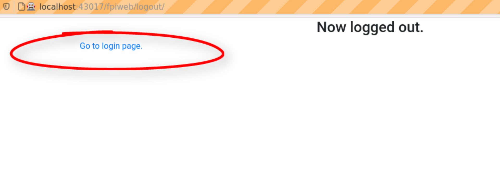

#################
User Management
#################

Login
******

Start at the **Login Screen** by entering your user name and password. In the graphic below
the user name is 'TestUser' and of course the password remains hidden on the screen. Then
click the **Login** button with your mouse.

You should now come to the **Main Menu** screen as seen below. Here you will be working with
the **User Management** menus and the **Inventory Management** menus. **System Management** is
for program administrators and you should not be able to click on and enter those menu items.

Change Password
****************

To change you password click on the **Change Password** button. Unfortunately this page is not
implemented yet. If you click on the **Change Password** button you will be directed to the
**About Screen** as shown below. Click on **Return to main page** to return to the **Main Menu**
screen.

Logout
*******

Whenever you have finished you should always log out! This will prevent the next person using
the program from making inadvertent changes in your name. Always click on the **Logout** button
when you are finished using the program.

After logging out you should see the **Now logged out.** screen. To go back to the login screen click
on **Go to login page.**

