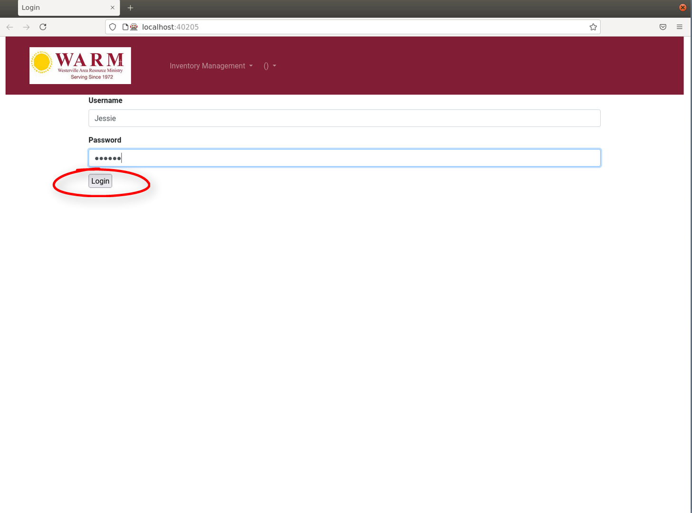
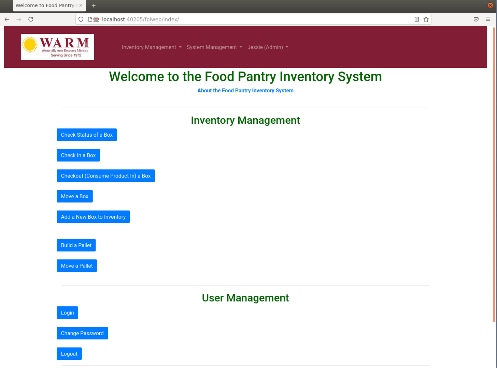
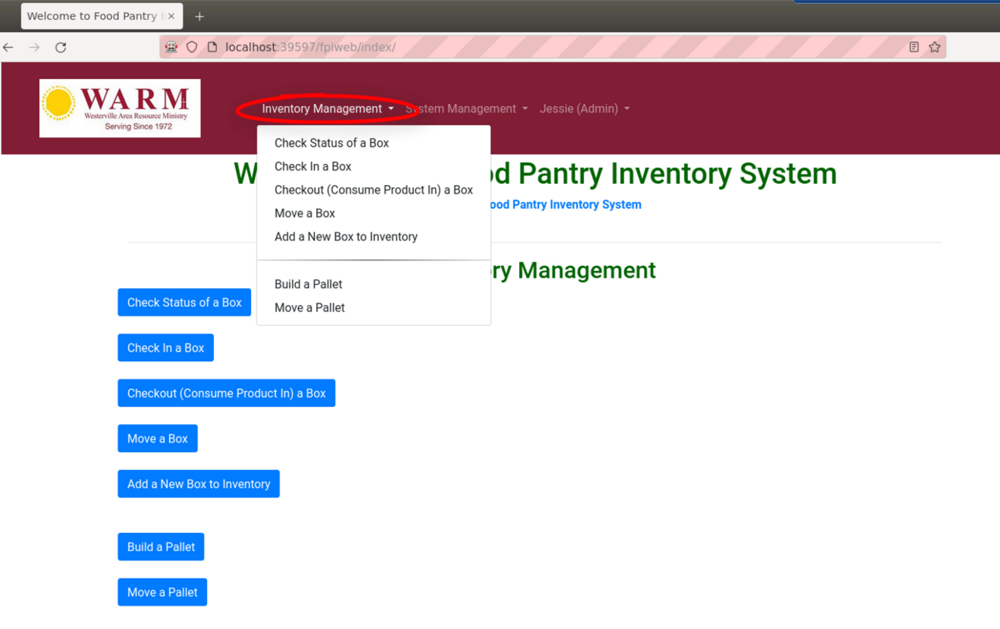
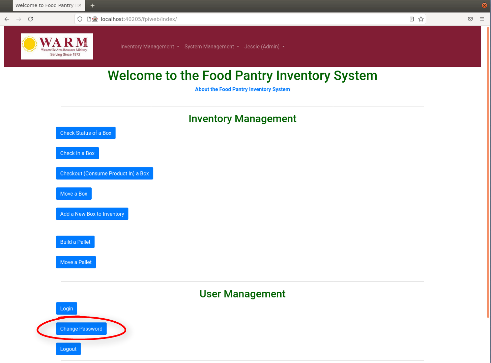
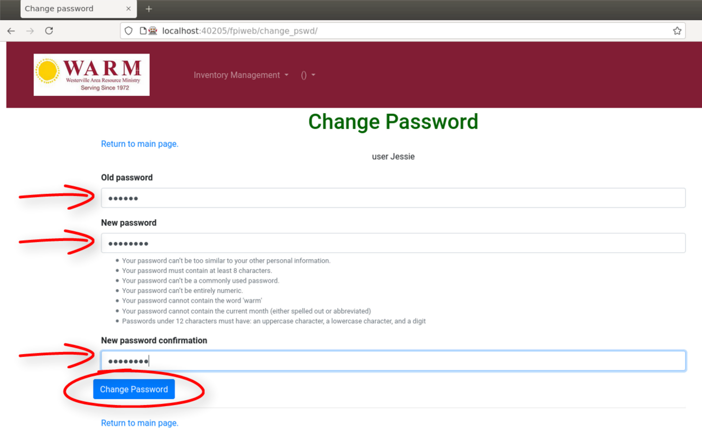
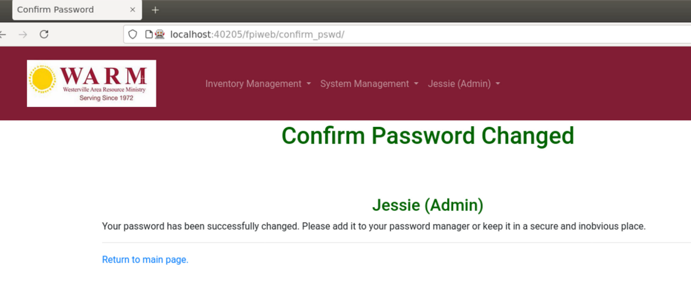
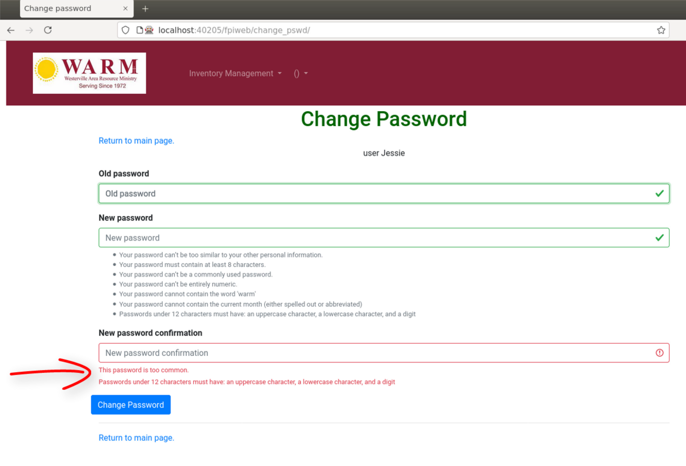
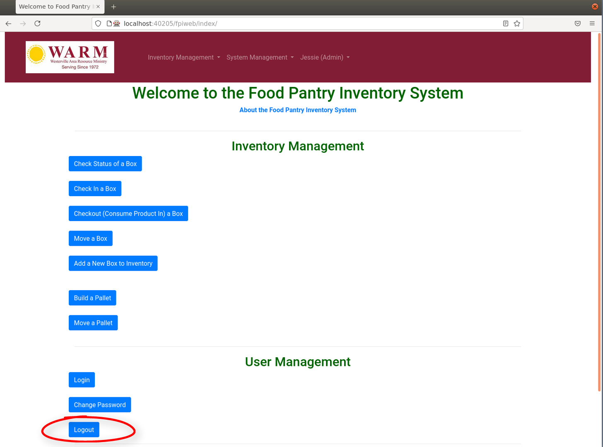
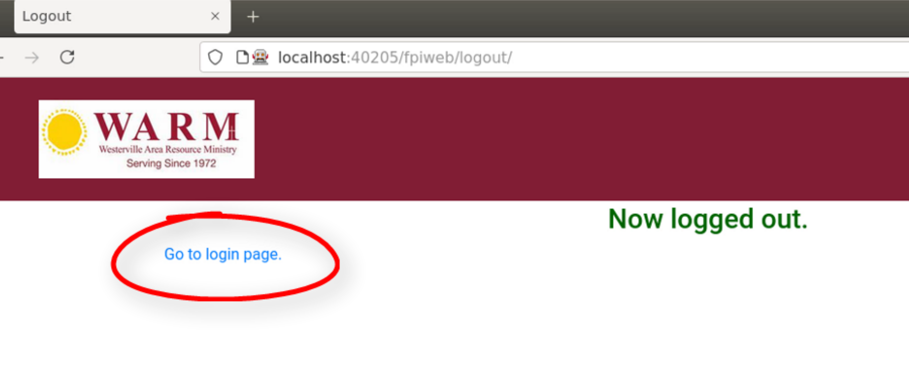

#################
User Management
#################

Login
******

Start at the **Login Screen** by entering your user name and password. In the
graphic below the user name is 'Jessie' and of course the password remains
hidden on the screen. Then click the **Login** button with your mouse.

You should now come to the **Main Menu** screen as seen below. Here you will be
working with the **User Management** menus and the **Inventory Management**
menus. **System Management** is for program administrators and you should not
be able to click on and enter those menu items.

The **Inventory Management** menu can also be accessed from the top bar menu.
On the top bar click on the triangle or down arrow to the right of the text
*Inventory Management*. A drop down **Inventory Management** menu will appear.
This menu goes to the exact same pages or screens as the **Inventory
Management** menu on the main page.

The **User Management** menu can also be accessed from the top bar menu.
Click on the triangle or down arro to the right of your login name in the top
menu bar to access the **User Management** menu.

Change Password
****************

To change your password click on the **Change Password** button.

You should come to the **Change Password** screen. You will need your old
password to change your password. You will have to enter your new password
twice. Between the new password entries you will have a list of rules the
new password must follow. Finally click on the **Change Password** button when
finished.

If your password change was a success you will see the screen below. Click on
**Return to main page** to go back to the Main Screen.

If the password change was not a success you should see a screen like the one
below. It will contain an error message that indicates what needs to be done
to change your password. In the page below the user entered the word
'password' as their password so their new password was rejected as being too
common.

Logout
*******

Whenever you have finished you should always log out! This will prevent the next
person usingthe program from making inadvertent changes in your name. Always
click on the **Logout** button as shown below when you are finished using the
program.

After logging out you should see the **Now logged out.** screen. To go back to
the login screen click on **Go to login page.**

